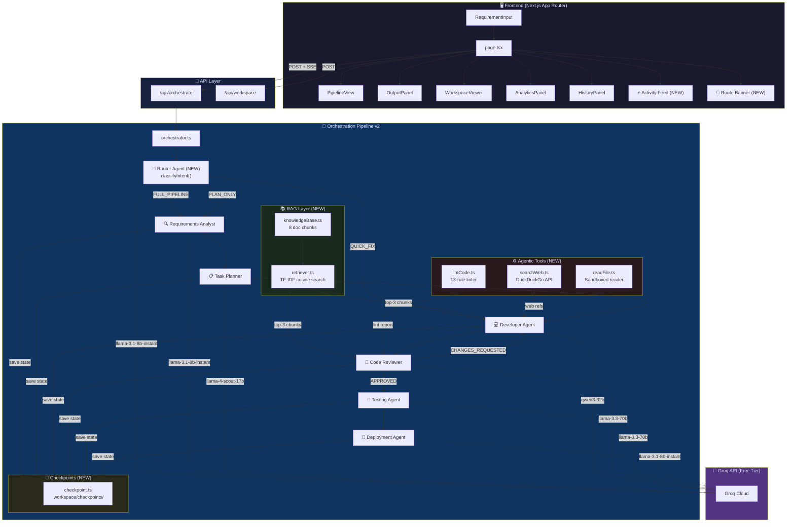

<div align="center">

# 🚀 Multi-Agent AI Orchestrator
### v2 — Autonomous AI Agents for End-to-End Software Development

**Transform plain English requirements into production-ready, tested, and deployment-configured code** — automatically analyzed, planned, developed, reviewed, tested, and deployed by **7 specialized AI agents** working in concert — now with **Intelligent Routing, RAG, Agentic Tools, and Resume-on-Failure**.

[](https://nextjs.org/)
[](https://www.typescriptlang.org/)
[](https://groq.com/)
[](https://sdk.vercel.ai/)
[](https://github.com/ParthivPandya/multi-agent-orchestrator)

[](https://github.com/ParthivPandya/multi-agent-orchestrator/stargazers)
[](https://github.com/ParthivPandya/multi-agent-orchestrator/network/members)
[](https://github.com/ParthivPandya/multi-agent-orchestrator/issues)
[](https://github.com/ParthivPandya/multi-agent-orchestrator/commits/main)
[](LICENSE)

### 🌟 If you find this useful, please give it a star! It helps the project grow! 🌟

[🚀 Quick Start](#-quick-start) · [✨ Features](#-key-features) · [🏗️ Architecture](#️-architecture-v2) · [🤖 Agents](#-the-7-agents-v2) · [📡 API Reference](#-api-reference) · [🗺️ Roadmap](#️-roadmap)

---

<div style="display:flex; flex-direction:column; gap:20px; align-items:center;">
    
    
    
</div>
</div>

---

## 🆕 What's New in v2

> v2 brings **5 major architectural enhancements** inspired by competitive analysis of CrewAI, ComposioHQ, AWS Agent Squad, and Kore.ai.

| Enhancement | Description | Inspired By |
|------------|-------------|-------------|
| 🧭 **Intelligent Routing** | A pre-classifier routes each request to the optimal pipeline subset, saving tokens and time | AWS Agent Squad |
| ⚙️ **Agentic Tools** | Agents can now *do* things: web search, workspace file reading, and static code linting | ComposioHQ, WSHobson |
| 📚 **RAG Knowledge** | In-memory TF-IDF retrieval grounds agents in up-to-date framework docs (Next.js 15, React 19, etc.) | Kore.ai, CrewAI |
| 🔀 **Flows DSL** | A typed `FlowDefinition` system maps pipeline modes to agent subsets — the foundation for custom crews | CrewAI |
| 💾 **Stateful Checkpoints** | Pipeline state is saved to disk after every stage. Resume from any failure point with one API call | ComposioHQ |

---

## 💡 Why This Project?

<table>
<tr>
<td width="55%">

Most AI code generators are **black boxes** — you type a prompt, wait, and hope for the best. This project takes a fundamentally different approach:

- 🏭 **Software Factory, Not a Chatbot** — 7 agents with distinct roles collaborate like a real dev team
- 🧭 **Smart Routing** — A classifier pre-screens every request and skips unnecessary agents automatically
- 🔄 **Self-Correcting** — The Code Reviewer catches bugs and sends code back for revision automatically
- 🧪 **Tests Included** — A dedicated Testing Agent auto-generates unit & integration tests for every project
- 📚 **RAG-Grounded** — Agents consult up-to-date framework docs before generating code — no deprecated APIs
- ⚙️ **Tools-Enabled** — Agents actively search the web and lint code, not just "think" in text
- 💾 **Resume on Failure** — Every stage is checkpointed. Groq API crash? Resume from where you left off
- 🛡️ **Battle-Hardened** — Every agent call has exponential backoff retry (up to 3 attempts)
- 👁️ **Full Transparency** — Watch every agent think, every tool call fire, every RAG doc retrieved in real-time
- 📊 **Analytics Built-in** — Per-agent token usage, latency charts, and cost estimates after every run
- 💸 **100% Free** — Runs on Groq's free tier. No OpenAI bills. No subscriptions.

</td>
<td width="45%">

### The v2 Pipeline

```
You: "Build a REST API for a
      todo app with auth"
         ↓
🧭 Router    → Classify intent
             → Select pipeline mode
         ↓
📚 RAG       → Retrieve framework docs
         ↓
🔍 Analyst   → Structured specs
📋 Planner   → Task breakdown
💻 Developer → Code + web search
      ↕ (Self-correcting loop)
🔎 Reviewer  → Code quality + lint
🧪 Tester    → Unit test suite
🚀 Deployer  → Docker + CI/CD
         ↓
You: Complete project + tests,
     checkpoint saved! 🎉
```

</td>
</tr>
</table>

---

## ✨ Key Features

<table>
<tr>
<td width="50%">

### 🧭 Intelligent Routing *(v2 New!)*
A `llama-3.1-8b-instant` pre-classifier runs before any agent. It detects 4 intent modes and skips irrelevant agents:
- `FULL_PIPELINE` — All 7 agents (complex build)
- `QUICK_FIX` — Dev + Reviewer only (bug fix/tweak)
- `PLAN_ONLY` — Analyst + Planner only (architecture question)
- `CODE_REVIEW_ONLY` — Reviewer only (paste code for review)

### 📚 RAG Knowledge Base *(v2 New!)*
Zero-dependency TF-IDF cosine retrieval against 8 curated knowledge chunks. Framework docs for **Next.js 15, React 19, TypeScript 5, Vercel AI SDK 4, Tailwind v4, Node.js, and Prisma** are injected into Developer and Reviewer prompts at runtime to prevent hallucinated or deprecated APIs.

### ⚙️ Agentic Tools Ecosystem *(v2 New!)*
Agents now have access to real tools:
- **`searchWeb`** — DuckDuckGo Instant Answer API (free, no key needed)
- **`readFile`** — Sandboxed workspace file reader (path-traversal safe)
- **`lintCode`** — 13-rule static linter with 0-100 quality score (checks for `eval`, hardcoded secrets, XSS, `any` types, React key props, and more)

All tool calls stream live to the **⚡ Agent Activity** feed in the UI.

### 💾 Stateful Checkpoints *(v2 New!)*
Every agent stage writes a JSON checkpoint to `.workspace/checkpoints/`. If the pipeline fails (Groq rate limit, network error, etc.), resume exactly where you left off by passing `resumeCheckpointId` to the API.

</td>
<td width="50%">

### 🔀 Pipeline Flows DSL *(v2 New!)*
A `FlowDefinition` system maps every pipeline mode to a typed, ordered list of agent nodes. This is the extensible foundation for user-defined custom crews — just add a YAML parser on top.

### 🔄 Fully Automated 7-Agent Pipeline
Plain English → production code → unit tests → deployment config. Zero manual intervention.

### 🧪 Auto-Generated Test Suite
The Testing Agent writes comprehensive Jest/Pytest/Go tests automatically based on the tech stack detected in the generated code.

### 🛡️ Exponential Backoff Retry
Every agent call is wrapped in retry logic: 3 automatic attempts with 2s → 4s → 8s backoff. Transient Groq API errors are handled silently.

### 🔁 Developer ↔ Reviewer Loop
Built-in feedback cycle: Code Reviewer sends rejected code back to Developer for revision (up to 3 iterations). Reviewer now has lint pre-analysis and RAG docs for more accurate reviews.

### 📊 Analytics Dashboard
Toggle the analytics panel after any run to see per-agent token usage, latency bars, and estimated cost — all in one view.

### 🕐 Pipeline History & Restore
Every run is saved to `localStorage`. Open the History panel, browse past runs with timestamps, and restore any of them with one click.

### ⚡ Real-Time SSE Streaming
Every agent's start, tool calls, RAG retrievals, checkpoint saves, and completion stream live to the UI.

</td>
</tr>
</table>

---

## 🏆 How Does It Compare?

| Feature | **This Project v2** | CrewAI | AWS Agent Squad | ComposioHQ | Kore.ai |
|---------|:---------------:|:-------:|:-------:|:------:|:------:|
| 💸 Completely Free | ✅ Groq free tier | ❌ | ❌ | ❌ | ❌ |
| 🖥️ Beautiful Web UI | ✅ Premium dark theme | ⚠️ CLI | ⚠️ CLI | ⚠️ CLI | ⚠️ Enterprise |
| ⚡ Real-time Streaming | ✅ SSE events | ❌ | ❌ | ❌ | ❌ |
| 🧭 Intelligent Routing | ✅ 4-mode classifier | ⚠️ Partial | ✅ Yes | ❌ | ❌ |
| 📚 RAG Knowledge | ✅ In-memory TF-IDF | ✅ Yes | ❌ | ❌ | ✅ Enterprise|
| ⚙️ Agentic Tools | ✅ Web + lint + files | ✅ Yes | ⚠️ Partial | ✅ Yes | ⚠️ Partial |
| 💾 Resume on Failure | ✅ Checkpoints | ❌ | ❌ | ⚠️ Partial | ❌ |
| 🔁 Self-Correcting Code | ✅ Dev↔Review loop | ✅ Yes | ⚠️ | ⚠️ | ⚠️ |
| 🧪 Auto Test Generation | ✅ Dedicated agent | ❌ | ❌ | ❌ | ❌ |
| 🛡️ Retry on Failure | ✅ Exp. backoff | ❌ | ❌ | ❌ | ⚠️ |
| 📊 Analytics Dashboard | ✅ Built-in | ❌ | ❌ | ❌ | ✅ Enterprise |
| 📦 Ready-to-Deploy Output | ✅ Docker + CI/CD | ❌ | ❌ | ❌ | ❌ |
| 🚀 One-Click Deploy | ✅ Vercel button | ❌ | ❌ | ❌ | ❌ |

---

## 🏗️ Architecture v2



---

## 🤖 The 7 Agents (v2)

| # | Agent | Model | Purpose | Max Tokens |
|---|-------|-------|---------|------------|
| 0 | 🧭 **Router / Classifier** *(New!)* | `llama-3.1-8b-instant` | Classifies intent → routes to optimal pipeline subset (FULL / QUICK_FIX / PLAN_ONLY / REVIEW_ONLY) | 512 |
| 1 | 🔍 **Requirements Analyst** | `llama-3.1-8b-instant` | Parses raw English → structured JSON specification with FRs, NFRs, acceptance criteria, tech stack | 2,048 |
| 2 | 📋 **Task Planner** | `llama-4-scout-17b-16e-instruct` | Breaks specifications → ordered tasks with IDs, priorities, dependencies, and sizing | 2,048 |
| 3 | 💻 **Developer Agent** | `qwen/qwen3-32b` | Writes complete, production-ready source code — augmented with RAG docs + web search results | 4,096 |
| 4 | 🔎 **Code Reviewer** | `llama-3.3-70b-versatile` | Reviews code with RAG docs + pre-computed lint analysis. Returns APPROVED or CHANGES_REQUESTED with score | 2,048 |
| 5 | 🧪 **Testing Agent** | `llama-3.3-70b-versatile` | Auto-generates unit & integration tests matched to the tech stack. Non-fatal — pipeline continues if it fails | 3,072 |
| 6 | 🚀 **Deployment Agent** | `llama-3.1-8b-instant` | Generates Dockerfile, docker-compose.yml, CI/CD pipelines, and deployment guides | 2,048 |

> **All agents** are individually wrapped in `withRetry()` — up to 3 attempts with exponential backoff (2s → 4s → 8s). The Router Agent always falls back to `FULL_PIPELINE` on any error so it never blocks users.

### v2 Pipeline Flow Modes

| Mode | Agents Run | Token Savings | Best For |
|------|-----------|---------------|----------|
| `FULL_PIPELINE` | All 7 | — | Build a new feature / app |
| `QUICK_FIX` | Router + Dev + Reviewer | ~60% | Small bug fix, style tweak |
| `PLAN_ONLY` | Router + Analyst + Planner | ~70% | Architecture planning |
| `CODE_REVIEW_ONLY` | Router + Reviewer | ~80% | Review pasted code |

### Developer ↔ Reviewer Feedback Loop (v2)

```
RAG retrieves framework docs
         ↓
Developer writes code + web search context
         ↓
Static linter runs (0-100 score)
         ↓
Code Reviewer reviews (with RAG + lint report)
         ↓
   APPROVED? ──── Yes ──→ Testing Agent → Deployment Agent
         ↓                        ↓
        No (CHANGES_REQUESTED)   Checkpoint saved to disk
         ↓
Developer revises (max 3 iterations)
```

---

## 🚀 Quick Start

### Prerequisites

- **Node.js** 18+ ([Download](https://nodejs.org/))
- **Groq API Key** (Free — [Get one here](https://console.groq.com/))

### Installation

```bash
# 1. Clone the repository
git clone https://github.com/ParthivPandya/multi-agent-orchestrator.git
cd multi-agent-orchestrator

# 2. Install dependencies
npm install

# 3. Set up environment variables
cp .env.example .env.local
```

### Configuration

Edit `.env.local` and add your Groq API key:

```env
# Get your free key at https://console.groq.com
GROQ_API_KEY=gsk_your_api_key_here
```

### Run

```bash
# Development server
npm run dev

# Open in browser
# → http://localhost:3000
```

### Build for Production

```bash
npm run build
npm start
```

---

## 📁 Project Structure (v2)

```
multi-agent-system/
├── src/
│   ├── app/
│   │   ├── page.tsx                        # Main UI — routing banner, activity feed, checkpoint state
│   │   ├── layout.tsx                      # Root layout with SEO metadata
│   │   ├── globals.css                     # Premium dark design system + animations
│   │   └── api/
│   │       ├── orchestrate/route.ts        # POST — 7-agent pipeline + resumeCheckpointId support
│   │       ├── agent/route.ts              # POST — Test individual agents
│   │       └── workspace/
│   │           ├── route.ts                # GET/POST — List & save workspace files
│   │           └── [project]/file/
│   │               └── route.ts            # GET — Read individual file content
│   ├── lib/
│   │   ├── orchestrator.ts                 # 🎯 v2 Pipeline controller — routing + RAG + tools + checkpoints
│   │   ├── context.ts                      # Shared state between agents
│   │   ├── fileParser.ts                   # Extracts code files from markdown output
│   │   ├── history.ts                      # localStorage pipeline history + analytics
│   │   ├── types/index.ts                  # TypeScript types — extended with all v2 types
│   │   ├── agents/
│   │   │   ├── routerAgent.ts              # 🧭 Router/Classifier — intent classification (v2 NEW)
│   │   │   ├── requirementsAnalyst.ts      # Agent 1 — Requirement parsing
│   │   │   ├── taskPlanner.ts              # Agent 2 — Task decomposition
│   │   │   ├── developer.ts                # Agent 3 — Code generation (+ RAG/search context)
│   │   │   ├── codeReviewer.ts             # Agent 4 — Code review (+ RAG/lint context)
│   │   │   ├── testingAgent.ts             # Agent 5 — Unit & integration test generation
│   │   │   └── deploymentAgent.ts          # Agent 6 — Deployment configs
│   │   ├── tools/                          # ⚙️ Agentic Tools (v2 NEW)
│   │   │   ├── index.ts                    # Barrel export
│   │   │   ├── searchWeb.ts                # DuckDuckGo Instant Answer API
│   │   │   ├── readFile.ts                 # Sandboxed workspace file reader
│   │   │   └── lintCode.ts                 # 13-rule static linter (0-100 score)
│   │   ├── rag/                            # 📚 RAG Knowledge Base (v2 NEW)
│   │   │   ├── knowledgeBase.ts            # 8 curated doc chunks (Next.js 15, React 19, TS5, etc.)
│   │   │   └── retriever.ts                # TF-IDF cosine similarity retrieval + keyword boosting
│   │   ├── flows/                          # 🔀 Flows DSL (v2 NEW)
│   │   │   └── types.ts                    # FlowDefinition, FlowAgentNode, BUILT_IN_FLOWS
│   │   ├── workspace/                      # 💾 Stateful Orchestration (v2 NEW)
│   │   │   └── checkpoint.ts               # Save/load/list checkpoints to .workspace/checkpoints/
│   │   └── prompts/
│   │       ├── analyst.prompt.ts           # System prompt for Agent 1
│   │       ├── planner.prompt.ts           # System prompt for Agent 2
│   │       ├── developer.prompt.ts         # System prompt for Agent 3 (+ RAG injection)
│   │       ├── reviewer.prompt.ts          # System prompt for Agent 4 (+ RAG + lint injection)
│   │       ├── testing.prompt.ts           # System prompt for Agent 5
│   │       └── deployer.prompt.ts          # System prompt for Agent 6
│   └── components/
│       ├── RequirementInput.tsx            # Input form with example prompts
│       ├── PipelineView.tsx                # v2: Router node + skipped agent styling
│       ├── AgentCard.tsx                   # v2: Supports 'skipped' status
│       ├── OutputPanel.tsx                 # Formatted/Raw/JSON output tabs
│       ├── WorkspaceViewer.tsx             # File tree + code viewer + save + ZIP export
│       ├── AnalyticsPanel.tsx              # Per-agent token/latency bar chart
│       └── HistoryPanel.tsx                # Slide-in past-runs panel with restore
├── .workspace/
│   └── checkpoints/                        # 💾 Pipeline checkpoint files (auto-created)
├── workspace/                              # 📂 Generated projects are saved here
├── .env.example                            # Environment variable template
├── package.json
└── tsconfig.json
```

---

## 📡 API Reference

### `POST /api/orchestrate`

Runs the pipeline with intelligent routing and real-time SSE streaming.

**Request:**
```json
{
  "requirement": "Build a REST API for a todo app with authentication",
  "resumeCheckpointId": "optional-checkpoint-id-for-resume"
}
```

**Response:** Server-Sent Events stream

| Event Type | Description |
|------------|-------------|
| `route_decision` | *(v2 New)* Router classified intent — includes mode, reasoning, skipped agents, confidence |
| `rag_retrieval` | *(v2 New)* RAG retrieved relevant docs — includes source names and chunks |
| `tool_call` | *(v2 New)* An agent is calling a tool (searchWeb, lintCode, etc.) |
| `tool_result` | *(v2 New)* Tool returned a result — includes output and duration |
| `checkpoint_saved` | *(v2 New)* Pipeline state saved to disk — includes checkpoint ID |
| `stage_start` | Agent has started processing |
| `stage_complete` | Agent finished — includes output, token count, and latency |
| `stage_error` | Agent encountered an unrecoverable error (after all retries) |
| `retry_attempt` | An agent failed and is being retried |
| `iteration_info` | Developer↔Reviewer loop iteration update |
| `pipeline_complete` | All agents finished |
| `final_result` | Complete results payload + checkpointId + routeDecision |

**Resume from checkpoint:**
```json
{
  "requirement": "Build a REST API for a todo app with authentication",
  "resumeCheckpointId": "lk3x2a-f4c1"
}
```
The pipeline will replay completed stages to the UI and continue from the last saved state.

---

### `POST /api/agent`

Test an individual agent in isolation.

**Request:**
```json
{
  "agentName": "testing-agent",
  "input": "function add(a, b) { return a + b; }"
}
```

**Valid agent names:** `router-agent`, `requirements-analyst`, `task-planner`, `developer`, `code-reviewer`, `testing-agent`, `deployment-agent`

---

### `POST /api/workspace`

Save generated project files (source + tests + configs) to disk.

**Request:**
```json
{
  "projectName": "my-todo-app",
  "files": [
    { "path": "src/index.ts", "content": "..." },
    { "path": "src/index.test.ts", "content": "..." },
    { "path": "Dockerfile", "content": "..." }
  ]
}
```

---

## 🛡️ Rate Limiting & Resilience

| Setting | Value |
|---------|-------|
| Inter-agent delay | 1,500ms (prevents Groq rate limits) |
| Max retry attempts per agent | **3** |
| Retry backoff schedule | 2s → 4s → 8s (exponential) |
| Max review iterations | 3 |
| Testing Agent failure | **Non-fatal** — pipeline continues to deployment |
| Router failure | **Always falls back to `FULL_PIPELINE`** — never blocks users |
| Web search timeout | 5s (non-blocking) |
| RAG context cap | Top-3 chunks per query |
| Groq free tier RPM | 30 requests/min |
| Groq free tier TPM | ~14,400 tokens/min |
| Max output per agent | 512 – 4,096 tokens |

---

## 🛠️ Tech Stack

| Technology | Purpose |
|------------|---------|
| [Next.js 16](https://nextjs.org/) | Full-stack React framework (App Router) |
| [TypeScript 5](https://www.typescriptlang.org/) | Type-safe development |
| [Vercel AI SDK v6](https://sdk.vercel.ai/) | Unified LLM interface |
| [@ai-sdk/groq](https://www.npmjs.com/package/@ai-sdk/groq) | Groq API provider |
| [Groq Cloud](https://groq.com/) | Ultra-fast LLM inference (free tier) |
| TF-IDF (custom) | In-memory vector similarity for RAG — zero dependencies |
| DuckDuckGo API | Free web search for Developer agent tool calls |
| Vanilla CSS | Custom glassmorphism design system + animations |

---

## 🚢 Deployment

### Deploy to Vercel (Recommended)

[](https://vercel.com/new/clone?repository-url=https://github.com/ParthivPandya/multi-agent-orchestrator&env=GROQ_API_KEY&envDescription=Get%20your%20free%20Groq%20API%20key&envLink=https://console.groq.com/)

1. Click the button above
2. Add your `GROQ_API_KEY` in the environment variables
3. Deploy — you're done! 🎉

> **Note:** Checkpoint persistence requires persistent filesystem. Vercel's ephemeral filesystem means checkpoints will not survive between deployments. Use Railway, Render, or Docker for persistent checkpoints.

### Deploy with Docker

```bash
# Build the image
docker build -t multi-agent-orchestrator .

# Run the container
docker run -p 3000:3000 -e GROQ_API_KEY=your_key_here multi-agent-orchestrator
```

---

## 🗺️ Roadmap

### ✅ Completed & Shipped

- [x] 6-agent automated pipeline with role-specific LLM models
- [x] Real-time SSE streaming UI with live agent progress
- [x] Developer ↔ Reviewer feedback loop (up to 3 iterations)
- [x] Workspace file manager with file tree viewer & save-to-disk
- [x] Premium glassmorphism dark UI with micro-animations
- [x] Individual agent testing API (`POST /api/agent`)
- [x] 🧪 **Agent 6: Testing Agent** — Auto-generates unit & integration tests
- [x] 🛡️ **Error Retry & Resilience** — Exponential backoff (2s → 4s → 8s) for all agents
- [x] 📊 **Analytics Dashboard** — Per-agent token usage, latency bars, cost estimate
- [x] 🕐 **Pipeline History & Persistence** — localStorage save/restore of past runs
- [x] 📥 **ZIP Export** — One-click download of all generated files
- [x] ⏱️ **Latency Tracking** — Per-agent `latencyMs` measured and displayed
- [x] 🔔 **Retry Notifications** — Live amber banner shown when a retry fires
- [x] **v2: 🧭 Intelligent Routing** — Pre-classifier routes to optimal pipeline subset (saves up to 80% tokens on micro-tasks)
- [x] **v2: ⚙️ Agentic Tools** — `searchWeb`, `lintCode`, `readFile` tool ecosystem
- [x] **v2: 📚 RAG Knowledge Base** — TF-IDF retrieval over Next.js 15, React 19, TypeScript 5, and more
- [x] **v2: 🔀 Flows DSL** — `BUILT_IN_FLOWS` typed flow definitions + extensible `FlowDefinition` system
- [x] **v2: 💾 Stateful Checkpoints** — Resume-on-failure with per-stage disk persistence

---

### 🚧 Coming Soon

<details>
<summary><b>1. 🌐 Multi-Provider LLM Support</b> — OpenAI, Anthropic, Ollama alongside Groq</summary>

Add a provider abstraction layer using Vercel AI SDK's built-in multi-provider support. Allow per-agent model selection from the UI, and support local models via Ollama for fully offline usage.

</details>

<details>
<summary><b>2. ✋ Human-in-the-Loop Review</b> — Pause pipeline for user approval before deployment</summary>

Add a "Pause before Deployment" toggle. When the Code Reviewer approves, show a modal with the generated code. User can type corrections or approve to continue.

</details>

<details>
<summary><b>3. 🔗 GitHub Integration</b> — One-click push generated code to a new GitHub repo</summary>

Add GitHub PAT configuration in settings. A "Push to GitHub" button creates a new repo via the GitHub API and auto-commits all generated files.

</details>

<details>
<summary><b>4. ⚡ Streaming Token-by-Token Output</b> — Watch code appear in real time</summary>

Switch agents from `generateText` to `streamText` (Vercel AI SDK). Stream individual tokens to the OutputPanel so users see code being written character by character.

</details>

<details>
<summary><b>5. 📝 Custom YAML Flows</b> — Define your own agent crews in YAML</summary>

Build on the v2 `FlowDefinition` system to allow users to write `orchestrator.yaml` files defining custom crews (e.g., a parallel Security + Developer crew inspired by CrewAI).

</details>

<details>
<summary><b>6. 🔌 Expanded RAG Knowledge Base</b> — More frameworks, user-uploadable docs</summary>

Allow users to upload their own documentation (e.g., internal API specs, company style guides) to the RAG knowledge base for framework-specific and company-specific code generation.

</details>

---

### 🔭 Future Vision

| Feature | Description |
|---------|-------------|
| 🧠 **Agent Memory** | Learn user preferences across sessions (coding style, language, frameworks) |
| 🖼️ **Vision-to-Code** | Upload UI mockups/screenshots → generate matching frontend code |
| 🌍 **Multi-Language Output** | Support Python, Go, Rust, Java — not just TypeScript/JavaScript |
| 🏗️ **Project Templates** | Pre-built starters (Next.js, Express, FastAPI) to reduce token usage |
| 🤝 **Collaborative Mode** | Multiple users working on the same pipeline in real-time |
| 🔐 **Security Scanner Agent** | Dedicated OWASP-based security audit agent |

---

## 🤝 Contributing

Contributions are welcome! The project is actively growing.

### How to Get Started

1. **Fork** the repository
2. **Create** a feature branch: `git checkout -b feature/amazing-feature`
3. **Commit** your changes: `git commit -m 'Add amazing feature'`
4. **Push** to the branch: `git push origin feature/amazing-feature`
5. **Open** a Pull Request

### Good First Issues

| Task | Difficulty | Description |
|------|:----------:|-------------|
| 📝 YAML Flow Parser | Medium | Add a YAML parser on top of `src/lib/flows/types.ts` to support custom crew definitions |
| 🌐 Multi-Provider LLM | Medium | Add `@ai-sdk/openai` as an alternative provider option |
| ✋ Human-in-the-Loop | Medium | Add a pause modal before the Deployment Agent runs |
| 🔗 GitHub Push | Medium | Create `lib/github.ts` using the GitHub REST API |
| ⚡ Token Streaming | Hard | Switch agents from `generateText` to `streamText` |
| 📚 Expand RAG KB | Easy | Add more knowledge chunks to `src/lib/rag/knowledgeBase.ts` |
| 📱 Mobile UI | Easy | Make the layout responsive for smaller screens |

> 💡 **Tip for new contributors:** The v2 architecture separates concerns cleanly — each new feature slot is in its own directory (`tools/`, `rag/`, `flows/`, `workspace/`). Adding a new tool takes ~30 lines. Adding a new knowledge chunk to the RAG base takes 10 lines.

---

## 📄 License

This project is licensed under the MIT License — see the [LICENSE](LICENSE) file for details.

---

<div align="center">

### Built with ❤️ by [Parthiv Pandya](https://github.com/ParthivPandya)

**Next.js** · **Vercel AI SDK** · **Groq API** · **TypeScript** · **RAG** · **Agentic Tools**

---

<sub>If this project saved you time or taught you something, consider giving it a ⭐</sub>

**[⬆ Back to Top](#-multi-agent-ai-orchestrator)**

</div>
