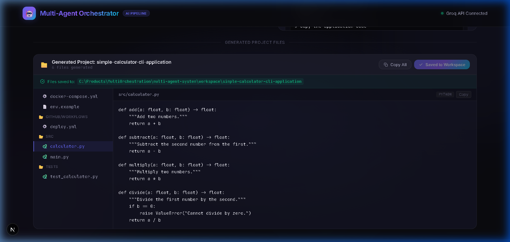
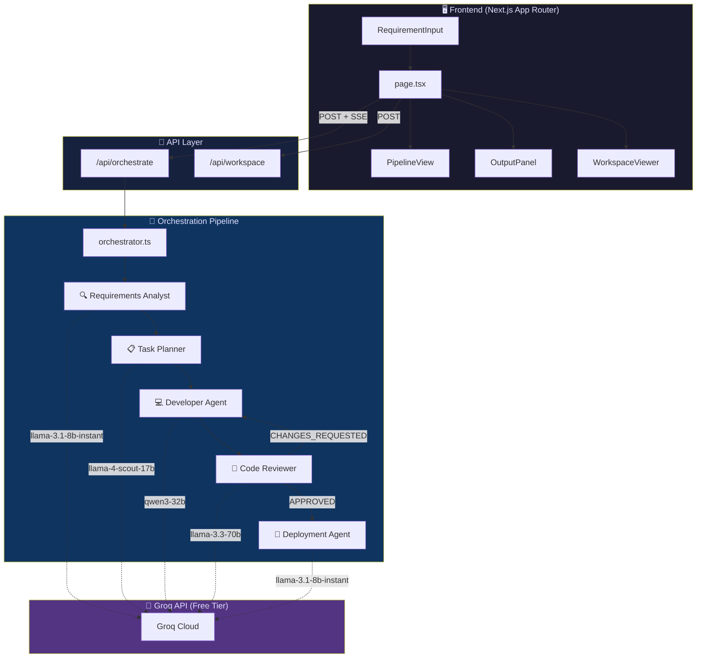

<div align="center">

# 🤖 Multi-Agent Orchestrator

### AI-Powered Software Development Pipeline

[](https://nextjs.org/)
[](https://www.typescriptlang.org/)
[](https://groq.com/)
[](https://sdk.vercel.ai/)
[](LICENSE)

**Transform plain English requirements into production-ready code** — automatically analyzed, planned, developed, reviewed, and deployment-configured by 5 specialized AI agents working in concert.

[🚀 Quick Start](#-quick-start) · [📸 Screenshots](#-screenshots) · [🏗️ Architecture](#️-architecture) · [🤖 Agents](#-the-5-agents) · [📡 API Reference](#-api-reference)

---


</div>

---

## ✨ Key Features

<table>
<tr>
<td width="50%">

### 🔄 Fully Automated Pipeline
Describe what you want in plain English → Get production-ready code with deployment configs. No manual intervention needed.

### 🧠 5 Specialized AI Agents  
Each agent uses a model optimized for its role — from fast structured extraction to deep code reasoning.

### 🔁 Developer ↔ Reviewer Loop
Built-in feedback cycle: the Code Reviewer sends rejected code back to the Developer Agent for revision (up to 3 iterations).

</td>
<td width="50%">

### ⚡ Real-Time Streaming
Server-Sent Events (SSE) stream live progress to the UI — see each agent start, process, and complete in real-time.

### 📁 Workspace File Manager
Auto-extracts generated code into real files. Browse in the file tree viewer, then save to disk with one click.

### 💰 Zero Cost
Runs entirely on Groq's free API tier. No credit card required. Estimated cost: **₹0/month**.

</td>
</tr>
</table>

---

## 📸 Screenshots

<details>
<summary><b>🖥️ Click to expand all screenshots</b></summary>

<br>

### Pipeline In Progress
> Requirements Analyst ✅ → Task Planner ✅ → Developer Agent ⚡ Running...


### Pipeline Complete — All 5 Agents Finished
> Every agent shows completion status with token usage stats.


### Code Review Output — Score: 9/10
> The reviewer provides structured feedback: approval status, score, issues found, and suggestions.


### Generated Project Files — File Tree + Code Viewer
> Auto-extracted files shown in an IDE-like interface with folder structure.


### Save to Workspace — Files Written to Disk
> One-click saves all generated files to a local workspace directory.



</details>

---

## 🏗️ Architecture



---

## 🤖 The 5 Agents

| # | Agent | Model | Purpose | Token Limit |
|---|-------|-------|---------|-------------|
| 1 | 🔍 **Requirements Analyst** | `llama-3.1-8b-instant` | Parses raw English → structured JSON specification with FRs, NFRs, acceptance criteria, tech stack | 2,048 |
| 2 | 📋 **Task Planner** | `llama-4-scout-17b-16e-instruct` | Breaks specifications → ordered tasks with IDs, priorities, dependencies, and sizing | 4,096 |
| 3 | 💻 **Developer Agent** | `qwen/qwen3-32b` | Writes complete, production-ready source code for all planned tasks | 8,192 |
| 4 | 🔎 **Code Reviewer** | `llama-3.3-70b-versatile` | Reviews code quality, security, best practices. Returns APPROVED or CHANGES_REQUESTED with score | 4,096 |
| 5 | 🚀 **Deployment Agent** | `llama-3.1-8b-instant` | Generates Dockerfile, docker-compose.yml, CI/CD pipelines, and deployment guides | 4,096 |

### Developer ↔ Reviewer Feedback Loop

```
Developer writes code → Reviewer reviews
                              ↓
                    APPROVED? ─── Yes → Deployment Agent
                              ↓
                              No (CHANGES_REQUESTED)
                              ↓
                    Developer revises (max 3 iterations)
```

---

## 🚀 Quick Start

### Prerequisites

- **Node.js** 18+ ([Download](https://nodejs.org/))
- **Groq API Key** (Free — [Get one here](https://console.groq.com/))

### Installation

```bash
# 1. Clone the repository
git clone https://github.com/ParthivPandya/multi-agent-orchestrator.git
cd multi-agent-orchestrator

# 2. Install dependencies
npm install

# 3. Set up environment variables
cp .env.example .env.local
```

### Configuration

Edit `.env.local` and add your Groq API key:

```env
# Get your free key at https://console.groq.com
GROQ_API_KEY=gsk_your_api_key_here
```

### Run

```bash
# Development server
npm run dev

# Open in browser
# → http://localhost:3000
```

### Build for Production

```bash
npm run build
npm start
```

---

## 📁 Project Structure

```
multi-agent-system/
├── src/
│   ├── app/
│   │   ├── page.tsx                    # Main UI — state management + SSE handler
│   │   ├── layout.tsx                  # Root layout with SEO metadata
│   │   ├── globals.css                 # Premium dark design system
│   │   └── api/
│   │       ├── orchestrate/route.ts    # POST — Full pipeline with SSE streaming
│   │       ├── agent/route.ts          # POST — Test individual agents
│   │       └── workspace/
│   │           ├── route.ts            # GET/POST — List & save workspace files
│   │           └── [project]/file/
│   │               └── route.ts        # GET — Read individual file content
│   ├── lib/
│   │   ├── orchestrator.ts             # 🎯 Pipeline controller + feedback loop
│   │   ├── context.ts                  # Shared state between agents
│   │   ├── fileParser.ts               # Extracts code files from markdown output
│   │   ├── types/index.ts              # TypeScript type definitions
│   │   ├── agents/
│   │   │   ├── requirementsAnalyst.ts  # Agent 1 — Requirement parsing
│   │   │   ├── taskPlanner.ts          # Agent 2 — Task decomposition
│   │   │   ├── developer.ts            # Agent 3 — Code generation
│   │   │   ├── codeReviewer.ts         # Agent 4 — Code review
│   │   │   └── deploymentAgent.ts      # Agent 5 — Deployment configs
│   │   └── prompts/
│   │       ├── analyst.prompt.ts       # System prompt for Agent 1
│   │       ├── planner.prompt.ts       # System prompt for Agent 2
│   │       ├── developer.prompt.ts     # System prompt for Agent 3
│   │       ├── reviewer.prompt.ts      # System prompt for Agent 4
│   │       └── deployer.prompt.ts      # System prompt for Agent 5
│   └── components/
│       ├── RequirementInput.tsx        # Input form with example prompts
│       ├── PipelineView.tsx            # Visual pipeline progress
│       ├── AgentCard.tsx               # Individual agent status card
│       ├── OutputPanel.tsx             # Formatted/Raw/JSON output tabs
│       └── WorkspaceViewer.tsx         # File tree + code viewer + save
├── workspace/                          # 📂 Generated projects are saved here
├── .env.example                        # Environment variable template
├── package.json
└── tsconfig.json
```

---

## 📡 API Reference

### `POST /api/orchestrate`

Runs the full 5-agent pipeline with real-time SSE streaming.

**Request:**
```json
{
  "requirement": "Build a REST API for a todo app with authentication"
}
```

**Response:** Server-Sent Events stream with the following event types:

| Event Type | Description |
|------------|-------------|
| `stage_start` | Agent has started processing |
| `stage_complete` | Agent finished — includes output and token count |
| `stage_error` | Agent encountered an error |
| `iteration_info` | Developer↔Reviewer loop iteration update |
| `pipeline_complete` | All agents finished |
| `final_result` | Complete results payload |

---

### `POST /api/agent`

Test an individual agent in isolation.

**Request:**
```json
{
  "agentName": "requirements-analyst",
  "input": "Build a todo app"
}
```

**Valid agent names:** `requirements-analyst`, `task-planner`, `developer`, `code-reviewer`, `deployment-agent`

---

### `POST /api/workspace`

Save generated project files to disk.

**Request:**
```json
{
  "projectName": "my-todo-app",
  "files": [
    { "path": "src/index.ts", "content": "..." },
    { "path": "package.json", "content": "..." }
  ]
}
```

---

### `GET /api/workspace`

List all saved projects in the workspace.

---

## 🛡️ Rate Limiting & Constraints

| Constraint | Value |
|------------|-------|
| Inter-agent delay | 1,500ms (prevents Groq rate limits) |
| Max review iterations | 3 |
| Groq free tier RPM | 30 requests/min |
| Groq free tier TPM | ~14,400 tokens/min |
| Max output per agent | 2,048 – 8,192 tokens |

---

## 🛠️ Tech Stack

| Technology | Purpose |
|------------|---------|
| [Next.js 16](https://nextjs.org/) | Full-stack React framework (App Router) |
| [TypeScript](https://www.typescriptlang.org/) | Type-safe development |
| [Vercel AI SDK v6](https://sdk.vercel.ai/) | Unified LLM interface |
| [@ai-sdk/groq](https://www.npmjs.com/package/@ai-sdk/groq) | Groq API provider |
| [Groq Cloud](https://groq.com/) | Ultra-fast LLM inference (free tier) |
| [Tailwind CSS](https://tailwindcss.com/) | Utility-first styling |
| Vanilla CSS | Custom glassmorphism design system |

---

## 🚢 Deployment

### Deploy to Vercel (Recommended)

[](https://vercel.com/new/clone?repository-url=https://github.com/ParthivPandya/multi-agent-orchestrator&env=GROQ_API_KEY&envDescription=Get%20your%20free%20Groq%20API%20key&envLink=https://console.groq.com/)

1. Click the button above
2. Add your `GROQ_API_KEY` in the environment variables
3. Deploy — you're done! 🎉

### Deploy with Docker

```bash
# Build the image
docker build -t multi-agent-orchestrator .

# Run the container
docker run -p 3000:3000 -e GROQ_API_KEY=your_key_here multi-agent-orchestrator
```

---

## 🗺️ Roadmap

- [x] 5-agent automated pipeline
- [x] Real-time SSE streaming UI
- [x] Developer ↔ Reviewer feedback loop
- [x] Workspace file manager with save-to-disk
- [ ] Streaming token-by-token output  
- [ ] GitHub integration (auto-create repos)
- [ ] Project template selection
- [ ] Multi-language support (Python, Go, Rust, etc.)
- [ ] Agent memory & learning from past projects
- [ ] Cost tracking dashboard
- [ ] Custom agent configuration UI

---

## 🤝 Contributing

Contributions are welcome! Here's how to get started:

1. **Fork** the repository
2. **Create** a feature branch: `git checkout -b feature/amazing-feature`
3. **Commit** your changes: `git commit -m 'Add amazing feature'`
4. **Push** to the branch: `git push origin feature/amazing-feature`
5. **Open** a Pull Request

---

## 📄 License

This project is licensed under the MIT License — see the [LICENSE](LICENSE) file for details.

---

<div align="center">

### Built with ❤️ using Next.js · Vercel AI SDK · Groq API

**[⬆ Back to Top](#-multi-agent-orchestrator)**

</div>
