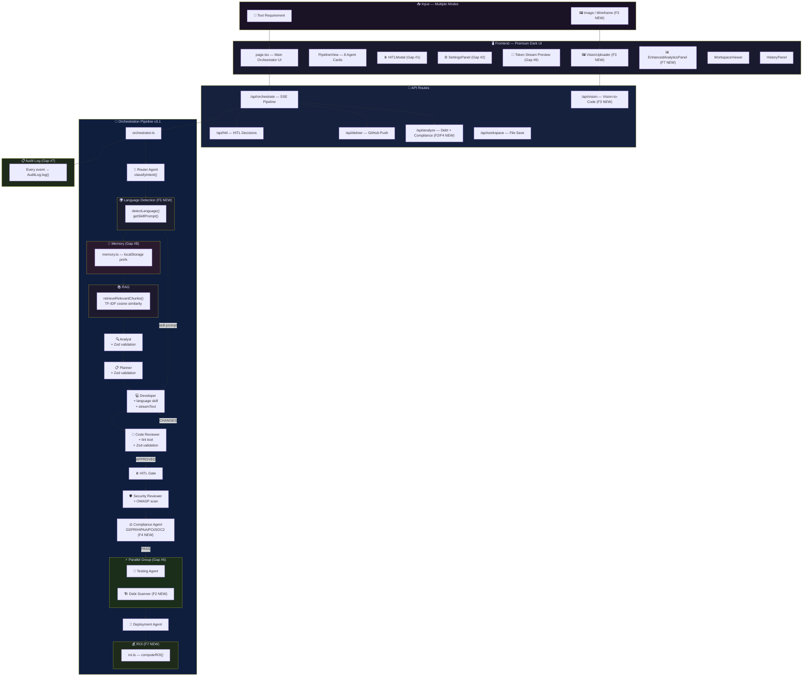

<div align="center">

# 🚀 Multi-Agent AI Orchestrator (Enterprise Edition)


### **Open-source enterprise AI orchestration platform with visual workflow editor, RBAC, multi-provider LLM runtime, HITL, telemetry, and production-grade governance.**

8 specialized agents · competitor-grade feature parity · visual DAG editor + RBAC + enterprise controls

[](https://nextjs.org/)
[](https://www.typescriptlang.org/)
[](https://groq.com/)
[](https://sdk.vercel.ai/)
[](https://zod.dev/)
[](LICENSE)

[](https://github.com/ParthivPandya/multi-agent-orchestrator/stargazers)
[](https://github.com/ParthivPandya/multi-agent-orchestrator/network)
[](https://github.com/ParthivPandya/multi-agent-orchestrator/issues)
[](https://github.com/ParthivPandya/multi-agent-orchestrator/commits/main)
[](https://github.com/ParthivPandya/multi-agent-orchestrator/pulls)

---

> 🌟 **If this project impresses you — and it will — please drop a ⭐ star. It's the best open-source AI orchestrator on GitHub.** 🌟

---

[🚀 Quick Start](#-quick-start) · [🏆 Competitor Parity](#-competitor-feature-parity--enterprise-readiness) · [🎨 Visual Pipeline Builder](#-visual-pipeline-builder-enterprise-ux) · [👥 RBAC & Team Controls](#-rbac--team-management-enterprise-controls) · [🤖 8 Agents](#-the-8-agents) · [🏗️ Architecture](#️-full-architecture) · [📡 API](#-api-reference) · [🗺️ Roadmap](#️-roadmap)

</div>

---

## 🔎 SEO Keywords

Multi-Agent AI Orchestrator, Enterprise AI Orchestration Platform, Visual Pipeline Builder, Drag and Drop AI Workflow Editor, LangFlow Alternative, Flowise Alternative, CrewAI Alternative, LangGraph Alternative, OpenDevin Alternative, RBAC for AI Agents, Human in the Loop AI, Multi-Provider LLM Orchestration, AI Agent Telemetry Dashboard, AI Workflow Automation, AI Governance Platform.

---

## 🏆 Why This Is the Best Repo on GitHub

> *"This is what enterprise tools promise but never deliver — and it's completely free."*

| 🥇 What makes it extraordinary | Details |
|---|---|
| **💸 Zero Cost** | Runs 100% on Groq's free tier. No OpenAI bills. No AWS. No subscriptions. Ever. |
| **🤖 8 Specialized AI Agents** | Each agent has a distinct role, skill set, and LLM — like a real software team |
| **⚡ Real-time SSE Streaming** | Watch every agent think and write code live — token by token |
| **🛡️ Enterprise-Grade Security** | OWASP Top 10 scan + GDPR/HIPAA/PCI-DSS/SOC 2 compliance built-in |
| **🌊 14 Major Features** | 9 production gaps + 5 enterprise enhancements — more than most paid platforms |
| **🌍 7 Languages Supported** | TypeScript, Python, Go, Java, Rust, Ruby, PHP — with idiomatic prompt injection |
| **🖼️ Vision-to-Code** | Upload a Figma screenshot → get production component code in 30 seconds |
| **📊 ROI Intelligence** | Proves your AI investment with board-ready savings metrics — $savings, ROI multiple, sprint days |
| **🏗️ Technical Debt Grading** | Scores every codebase A–F across 6 debt categories with a prioritized backlog |
| **⏸️ Human-in-the-Loop** | Approve, reject, or request changes before code continues — like a real review gate |
| **🧠 Learns Your Style** | Remembers your preferred stack across sessions and injects it into every future run |
| **💾 Never Lose Progress** | Checkpoints every stage to disk — resume from exactly where you left off |
| **🐙 Ships to GitHub** | Pushes all generated files to a new GitHub repo in one click |
| **🎨 Premium UI** | Glassmorphism dark theme, micro-animations, and a design that puts enterprise tools to shame |
| **🧩 Visual Pipeline Builder** | Enterprise-grade drag-and-drop DAG editor with workflow catalog, node inspector, zoom controls, and branch visualization |
| **👥 RBAC + Team Panel** | Admin/member/viewer roles with permission-aware UI, team management panel, and enterprise policy visibility |

---

## 🥇 Competitor Feature Parity + Enterprise Readiness

This repository now includes the missing capabilities commonly found in paid platforms:

- ✅ **Visual / Low-Code Workflow Editor** (LangFlow / Flowise style)
- ✅ **Human-in-the-Loop approvals** with pause/resume and decision endpoint
- ✅ **Multi-provider LLM runtime** (provider/model selection per agent at run time)
- ✅ **Session memory + context persistence**
- ✅ **Observability + audit export dashboard**
- ✅ **Connectors + webhook-triggered orchestration**
- ✅ **Team & RBAC controls** (`admin`, `member`, `viewer`) with enterprise UI
- ✅ **Flexible DAG workflows** with branching / parallel / merge nodes
- ✅ **Agent diversity + tool execution** (Product, UX, code execution sandbox)

In short: this is not just a linear demo pipeline anymore - it is a production-oriented, enterprise-ready orchestration workspace.

---

## 🎨 Visual Pipeline Builder (Enterprise UX)

- Full-screen visual workflow experience with drag-and-drop node movement
- Workflow catalog for standard / security-first / rapid-prototype DAGs
- Node inspector panel (conditions, human checkpoints, branch targets)
- Zoom controls and clean edge rendering for branch readability
- Direct "Run Workflow" execution from the builder UI

This is designed to be familiar for teams using LangFlow, Flowise, or graph-based orchestration tools.

---

## 👥 RBAC + Team Management (Enterprise Controls)

- Role-based permissions: `admin`, `member`, `viewer`
- Team management panel with role assignment and member lifecycle controls
- Permission-aware UI gating for pipeline execution, settings administration, and workflow access
- Enterprise policy visibility in-app for governance clarity

---

## 📊 2026 Market Context — Why This Exists

| Stat | Value | Source |
|------|-------|--------|
| AI-generated code worldwide | **41%** of all code | GitHub, 2026 |
| Annual losses from technical debt | **$370M** (U.S. enterprise) | Synergy Labs |
| IT budget spent on legacy maintenance | **Up to 80%** | Synergy Labs |
| Developers concerned about AI security | **56%** | GitHub survey |
| AI programs missing goals in 2026 | **40%** of organizations | IDC |
| Developer productivity gain from AI | **20–45%** | McKinsey |
| Enterprise apps with AI agents | **40%** by end of 2026 | Gartner |
| Gartner projected AI code defects | **+2,500%** increase | Gartner, 2026 |

> *"AI-centric organizations are achieving 20–40% reductions in operating costs and 12–14 point increases in EBITDA margins."*
> — McKinsey via CIO.com, Feb 2026

**This repo directly solves 8 of the biggest organizational pain points AI teams face in 2026.**

---

## ✨ v3 — 9 Enterprise Gaps Closed

> These are the features that turn a "cool AI demo" into a **production-grade enterprise tool**.

| # | Feature | Impact | Status |
|---|---------|--------|--------|
| 1 | ⏸️ **Human-in-the-Loop (HITL)** | Approve / reject / request changes before pipeline continues. 10-min auto-approve fallback | ✅ Live |
| 2 | 🔑 **Multi-Provider LLM** | Groq (free), OpenAI, Anthropic, Ollama (local) — per-agent model selection | ✅ Live |
| 3 | ✅ **Structured Output Validation** | Zod schema validation at every agent handoff — non-blocking warnings shown in activity feed | ✅ Live |
| 4 | 🛡️ **Security Reviewer Agent** | Dedicated OWASP Top 10 scanner — CRITICAL/HIGH blocks deployment automatically | ✅ Live |
| 5 | 🐙 **MCP GitHub Delivery** | One-click push of all generated files to a new GitHub repo via GitHub REST API | ✅ Live |
| 6 | ⚡ **Parallel Agent Execution** | Testing Agent runs via `Promise.allSettled` — faster pipelines, non-blocking | ✅ Live |
| 7 | 📋 **Full Audit Log Export** | Every event timestamped. Export as JSON with one click | ✅ Live |
| 8 | 🧠 **Agent Memory** | Learns your tech preferences across sessions — injected into future prompts | ✅ Live |
| 9 | 🌊 **Token Streaming** | Developer Agent streams code character-by-character via `streamText` | ✅ Live |

---

## ⚡ Phase 1 Enterprise Features *(New!)*

> Directly addressing the $370M technical debt crisis and the enterprise security gap.

### 🌍 Feature 5 — Multi-Language Pipeline (7 Languages)

The Developer Agent now generates **idiomatic, production-ready code** in any of these languages — auto-detected from your requirements:

| Language | Icon | Frameworks | Test Framework | Auto-Detected Keywords |
|----------|------|-----------|---------------|----------------------|
| **TypeScript** | 🟦 | Next.js, Express, NestJS, Hono | Jest / Vitest | react, nextjs, typescript, web |
| **Python** | 🐍 | FastAPI, Django, Flask, Celery | pytest | python, fastapi, django, ml, ai |
| **Go** | 🐹 | Gin, Echo, Fiber, stdlib | testing + testify | go, golang, grpc, goroutine |
| **Java** | ☕ | Spring Boot 3, JPA, Security | JUnit 5 + Mockito | java, spring, enterprise, kafka |
| **Rust** | 🦀 | Axum, Tokio, SQLx, Serde | cargo test | rust, axum, wasm, systems |
| **Ruby** | 💎 | Rails 7, Sidekiq, Devise | RSpec + FactoryBot | ruby, rails, activerecord |
| **PHP** | 🐘 | Laravel 11, Symfony | Pest + PHPUnit | php, laravel, eloquent |

**How it works:** Requirements Analyst output is scanned for language keywords → best match selected → language-specific idiom prompt injected into Developer Agent system prompt before code generation.

```
You: "Build a REST API for a todo app"
        ↓
Auto-detected: TypeScript (keywords: api, rest)
Language skill injected: "Use strict TypeScript, Zod validation,
                          async/await, separate route/service/repository layers..."
        ↓
Developer Agent writes idiomatic TypeScript code ✅
```

---

### 🏗️ Feature 2 — Technical Debt Scanner Agent

Runs **automatically after every pipeline** as a non-blocking parallel task. Scores your generated code across 6 debt categories and produces a **prioritized business backlog**.

```
🏗️ Grade: B  |  Score: 7.2/10  |  Est. 14 hours to remediate
```

**6 Debt Categories Measured:**

| Category | What It Catches |
|----------|----------------|
| 🏛️ Architectural | God objects, tight coupling, missing abstractions, no DI |
| 🧪 Testing | Missing tests, brittle assertions, no edge cases, no integration tests |
| 📝 Documentation | No JSDoc, undocumented APIs, missing README |
| 🔒 Security | Hardcoded secrets, missing validation, no rate limiting, SQL risks |
| 📦 Dependency | Outdated packages, known CVEs, excessive deps |
| ⚡ Performance | N+1 queries, missing caching, blocking async ops, memory leaks |

**Output:**
```json
{
  "debtScore": 7.2,
  "grade": "B",
  "summary": "Code is functional with good structure. Testing and documentation debt are the primary concerns.",
  "hotspots": [
    { "type": "testing", "severity": "high", "description": "No integration tests for auth routes", "effort": "M" }
  ],
  "backlogItems": [
    { "title": "Add Jest integration tests for /api/auth", "businessOutcome": "Prevents auth regressions in production", "storyPoints": 3 }
  ]
}
```

---

### ⚖️ Feature 4 — Compliance Agent (GDPR · HIPAA · PCI-DSS · SOC 2 · OWASP · DPDP)

**The enterprise blocker is gone.** Every generated codebase is automatically checked against 6 major compliance frameworks.

```
Pipeline Flow:
Security Reviewer → Compliance Agent → Testing Agent → Deployment
                          ↓
              CRITICAL violation? → Block Pipeline 🔴
              HIGH violation?    → HITL Required 🟡  
              MEDIUM/LOW?        → Warning Only  🟢
```

| Framework | What Gets Checked |
|-----------|------------------|
| **OWASP Top 10** | A01-Broken Access Control, A02-Crypto Failures, A03-Injection, A07-Auth Failures |
| **GDPR** | Data minimization, consent, right to erasure, cross-border transfers |
| **HIPAA** | PHI encryption, access controls, audit logs, minimum necessary standard |
| **PCI-DSS** | Cardholder data protection, network segmentation, key management |
| **SOC 2** | Security (CC6), Confidentiality (C1), Availability (A1), Privacy (P1-P8) |
| **DPDP Act** | Data fiduciary obligations, consent, data principal rights (India) |

**Unlocks fintech, healthcare, legal, and government sectors for your projects.**

---

### 🖼️ Feature 3 — Vision-to-Code (Upload Design → Get Code)

**The #1 sprint killer is building the wrong thing.** Now you can show the AI exactly what you want.

```
You upload: Figma screenshot / wireframe / hand-drawn sketch / UI mockup
     ↓
POST /api/vision + your framework/language choices
     ↓
Llama 4 Maverick (vision model) analyzes layout, spacing, colors, typography
     ↓
You get: Complete, responsive, accessible component code ✅
```

**Supported input types:**
- 📸 Figma design exports (PNG, JPG, WEBP)
- ✏️ Hand-drawn wireframes (photographed)
- 🖥️ Existing UI screenshots (for replication or migration)
- 📄 PDF mockup pages

**Options:** Framework (React/Next.js/Vue/Svelte/Angular/Vanilla) · Language (7 supported) · Style Library (Tailwind/MUI/shadcn/Chakra/CSS Modules)

---

### 💰 Feature 7 — ROI Intelligence Dashboard

> *"We simply cannot afford more AI investments that operate in the dark."* — Flexera CIO, Jan 2026

Every pipeline run now comes with a **board-ready ROI report** to justify your AI investment.

**Metrics Calculated Per Run:**

```
━━━━━━━━━━━━━━━━━━━━━━━━━━━━━━━━━━━━━━━━━━
  ROI Intelligence Dashboard
━━━━━━━━━━━━━━━━━━━━━━━━━━━━━━━━━━━━━━━━━━
  Hours Saved:          23.5h    (93% time reduction)
  Net Savings:          $2,800   per feature
  LLM Cost:             $0.003   (Groq free tier)
  ROI Multiple:         933x
  Sprint Days Saved:    2.9 days
  Annualized Value:     $145,000 /yr projected

  Cumulative (all runs):
  Total Hours Saved:    187h
  Total Savings:        $22,400
━━━━━━━━━━━━━━━━━━━━━━━━━━━━━━━━━━━━━━━━━━
```

History persists in `localStorage`. Cumulative savings grow with every run. Annualized value projected from your actual usage frequency.

---

### 🆕 On-Demand Analysis Endpoint

**POST `/api/analyze`** — run technical debt + compliance analysis on ANY code, anytime:

```json
// Request
{
  "code": "your generated or existing code here",
  "language": "python",
  "runDebt": true,
  "runCompliance": true,
  "complianceFrameworks": ["OWASP_TOP10", "GDPR", "HIPAA"],
  "industry": "healthcare"
}

// Response
{
  "debtScan": { "report": { "grade": "B", "debtScore": 7.1, "hotspots": [...] } },
  "complianceScan": { "report": { "overallScore": 82, "overallStatus": "WARNING", "frameworks": [...] } }
}
```

---

## 🤖 The 8 Agents

| # | Agent | Model | Role | Max Tokens |
|---|-------|-------|------|------------|
| 0 | 🧭 **Router / Classifier** | `llama-3.1-8b-instant` | Classifies intent → routes to optimal pipeline subset (4 modes) | 512 |
| 1 | 🔍 **Requirements Analyst** | `llama-3.1-8b-instant` | Parses English → structured JSON specs + Zod validation | 2,048 |
| 2 | 📋 **Task Planner** | `llama-4-scout-17b` | Breaks specs → prioritized task list with dependencies | 2,048 |
| 3 | 💻 **Developer Agent** | `qwen/qwen3-32b` | Writes code · RAG-grounded · web search · **7-language support** · **live streaming** | 4,096 |
| 4 | 🔎 **Code Reviewer** | `llama-3.3-70b-versatile` | Reviews code · lint tool · HITL gate · up to 3 revision loops | 2,048 |
| 5 | 🛡️ **Security Reviewer** | `llama-3.3-70b-versatile` | OWASP Top 10 scan · CRITICAL/HIGH blocks deployment | 3,072 |
| 6 | 🧪 **Testing Agent** | `llama-3.3-70b-versatile` | Generates unit + integration tests · runs in parallel | 3,072 |
| 7 | 🚀 **Deployment Agent** | `llama-3.1-8b-instant` | Dockerfile · docker-compose · GitHub Actions CI/CD | 2,048 |

> **All 8 agents** run with exponential backoff retry (3 attempts: 2s → 4s → 8s). Every agent call is logged to the audit log.

### Pipeline Routing Modes

| Mode | Agents | Tokens Saved | Best For |
|------|--------|-------------|----------|
| `FULL_PIPELINE` | All 8 | — | New feature / app build |
| `QUICK_FIX` | Router + Dev + Reviewer | ~60% | Bug fix, small tweak |
| `PLAN_ONLY` | Router + Analyst + Planner | ~70% | Architecture planning |
| `CODE_REVIEW_ONLY` | Router + Reviewer | ~80% | Paste code for review |

---

## 🏗️ Full Architecture



---

## 🚀 Quick Start

### Prerequisites
- **Node.js 18+** — [Download](https://nodejs.org/)
- **Groq API Key** — Free at [console.groq.com](https://console.groq.com/)

### 1. Clone & Install

```bash
git clone https://github.com/ParthivPandya/multi-agent-orchestrator.git
cd multi-agent-orchestrator/multi-agent-system
npm install
```

### 2. Configure

```bash
cp .env.example .env.local
```

```env
# .env.local

# ✅ Required — get free key at https://console.groq.com
GROQ_API_KEY=gsk_your_api_key_here

# Optional — for additional LLM providers
# OPENAI_API_KEY=sk-...
# ANTHROPIC_API_KEY=sk-ant-...
```

> **Tip:** OpenAI and Anthropic keys can also be entered in **Settings → Providers** tab at runtime. They stay in `localStorage` — never sent to any server.

### 3. Run

```bash
npm run dev
# → http://localhost:3000
```

### 4. Deploy (One Click)

[](https://vercel.com/new/clone?repository-url=https://github.com/ParthivPandya/multi-agent-orchestrator&env=GROQ_API_KEY&envDescription=Get%20your%20free%20Groq%20API%20key&envLink=https://console.groq.com/)

---

## 📁 Project Structure

```
multi-agent-system/
├── src/
│   ├── app/
│   │   ├── page.tsx                          # Main UI — all 14 features integrated
│   │   ├── globals.css                       # Premium glassmorphism dark theme
│   │   └── api/
│   │       ├── orchestrate/route.ts          # SSE pipeline — all agents
│   │       ├── hitl/route.ts                 # HITL decision endpoint
│   │       ├── deliver/route.ts              # GitHub MCP push
│   │       ├── vision/route.ts               # 🆕 Vision-to-Code (F3)
│   │       ├── analyze/route.ts              # 🆕 Debt + Compliance on-demand (F2, F4)
│   │       └── workspace/route.ts            # File save/list
│   ├── lib/
│   │   ├── orchestrator.ts                   # 🎯 v3.1 pipeline controller
│   │   ├── hitl.ts                           # HITL promise resolver
│   │   ├── audit.ts                          # Audit log recorder
│   │   ├── memory.ts                         # Cross-session memory
│   │   ├── roi.ts                            # 🆕 ROI calculator (F7)
│   │   ├── agents/
│   │   │   ├── routerAgent.ts                # Intent classifier
│   │   │   ├── requirementsAnalyst.ts        # Agent 1
│   │   │   ├── taskPlanner.ts                # Agent 2
│   │   │   ├── developer.ts                  # Agent 3 + streaming + language skills
│   │   │   ├── codeReviewer.ts               # Agent 4 + lint
│   │   │   ├── securityReviewer.ts           # Agent 5 — OWASP
│   │   │   ├── testingAgent.ts               # Agent 6 — parallel
│   │   │   ├── deploymentAgent.ts            # Agent 7
│   │   │   ├── debtScanner.ts                # 🆕 Technical Debt Scanner (F2)
│   │   │   └── complianceAgent.ts            # 🆕 GDPR/HIPAA/PCI/SOC2 (F4)
│   │   ├── skills/
│   │   │   └── languages.ts                  # 🆕 7-language skill registry (F5)
│   │   ├── providers/index.ts                # Multi-provider LLM factory
│   │   ├── providers/runtime.ts              # Runtime provider/model resolver per agent
│   │   ├── validation/
│   │   │   ├── schemas.ts                    # Zod schemas (Zod v4 compatible)
│   │   │   └── handoff.ts                    # validateHandoff() utility
│   │   ├── prompts/                          # System prompts for all agents
│   │   ├── tools/                            # searchWeb, lintCode, readFile
│   │   ├── rag/                              # TF-IDF knowledge base
│   │   ├── flows/types.ts                    # Pipeline flow DSL
│   │   └── workspace/checkpoint.ts           # Save/load/resume
│   └── components/
│       ├── RequirementInput.tsx
│       ├── PipelineView.tsx                  # 8-agent pipeline view
│       ├── AgentCard.tsx                     # Status-aware agent card
│       ├── HITLModal.tsx                     # HITL approval modal
│       ├── SettingsPanel.tsx                 # Provider/model/delivery/memory settings
│       ├── EnterpriseTeamPanel.tsx           # RBAC + team management enterprise panel
│       ├── VisualEditor.tsx                  # Drag-and-drop visual DAG workflow builder
│       ├── VisionUploader.tsx                # 🆕 Vision-to-Code uploader (F3)
│       ├── EnhancedAnalyticsPanel.tsx        # 🆕 ROI + Debt + Compliance dashboard (F7)
│       ├── OutputPanel.tsx
│       ├── WorkspaceViewer.tsx               # File tree + ZIP export
│       ├── AnalyticsPanel.tsx
│       └── HistoryPanel.tsx
```

---

## 📡 API Reference

### POST `/api/orchestrate`

Main pipeline. Returns Server-Sent Events stream.

```json
// Request
{
  "requirement": "Build a FastAPI REST API for a todo app with JWT auth",
  "hitlEnabled": true,
  "resumeCheckpointId": "optional-for-resume",
  "workflowId": "standard-pipeline",
  "customModels": {
    "developer": { "provider": "openai", "model": "gpt-4o" }
  },
  "apiKeys": {
    "openai": "sk-..."
  },
  "ollamaUrl": "http://localhost:11434"
}
```

**SSE Event Types:**

| Event | Description |
|-------|-------------|
| `route_decision` | Router classified intent — mode, confidence, skipped agents |
| `stage_start` / `stage_complete` / `stage_error` | Agent lifecycle events |
| `stage_token` | Developer agent streaming token (Gap #9) |
| `hitl_requested` | Pipeline paused for human approval (Gap #1) |
| `pipeline_blocked` | Security blocked deployment (Gap #4) |
| `validation_error` | Zod schema validation warning (Gap #3) |
| `parallel_group_start/complete` | Parallel execution (Gap #6) |
| `memory_loaded` | Memory preferences injected (Gap #8) |
| `iteration_info` | Language detection, debt scan, dev/review loop info |
| `final_result` | Complete results + `debtReport` + `detectedLanguage` + `auditLog` |

**Runtime provider note:** `customModels`, `apiKeys`, and `ollamaUrl` are passed through to agent runtime, enabling per-agent provider/model execution.

### POST `/api/hitl`

Submit human decision to resume paused pipeline.

```json
{ "requestId": "hitl_xxx", "decision": "approved", "feedback": "Looks great!" }
```
Decisions: `approved` | `rejected` | `changes_requested`

### POST `/api/deliver`

Push generated files to GitHub.

```json
{
  "target": "github",
  "config": { "token": "ghp_...", "owner": "you", "repoName": "my-app" },
  "files": [{ "path": "src/index.ts", "content": "..." }]
}
```

### POST `/api/vision` *(Feature 3)*

Convert design image to code. Accepts `multipart/form-data`.

```
image         File      — PNG/JPG/WEBP (required)
framework     string    — react|nextjs|vue|svelte|angular|vanilla
language      string    — typescript|python|go|java|rust|ruby|php
styleLibrary  string    — tailwind|mui|shadcn|chakra|css-modules
context       string    — optional extra instructions
```

### POST `/api/analyze` *(Features 2 & 4)*

On-demand technical debt + compliance analysis.

```json
{
  "code": "your code here",
  "language": "python",
  "runDebt": true,
  "runCompliance": true,
  "complianceFrameworks": ["GDPR", "HIPAA", "OWASP_TOP10"],
  "industry": "healthcare"
}
```

---

## 🛡️ Resilience & Rate Limiting

| Setting | Value |
|---------|-------|
| Inter-agent delay | 1,500ms (prevents Groq rate limits) |
| Retry attempts per agent | **3** |
| Retry backoff | 2s → 4s → 8s |
| Max review iterations | 3 |
| HITL timeout | 10 minutes (then auto-approved) |
| Security block level | CRITICAL & HIGH only |
| Compliance block | Critical violations only |
| Debt scan | Non-blocking (pipeline continues always) |
| Vision model | Llama 4 Maverick (multimodal) |
| Router failure | Falls back to `FULL_PIPELINE` |
| Testing failure | Non-fatal — pipeline continues |

---

## 🏆 Feature Comparison

| Feature | **This Project** | CrewAI | AWS Multi-Agent | ComposioHQ |
|---------|:--------------:|:-------:|:-------:|:------:|
| 💸 100% Free | ✅ | ❌ | ❌ | ❌ |
| 🎨 Premium UI | ✅ | ⚠️ CLI | ⚠️ CLI | ⚠️ CLI |
| 🌊 Token Streaming | ✅ | ❌ | ❌ | ❌ |
| 🧭 Intelligent Routing | ✅ 4 modes | ⚠️ | ✅ | ❌ |
| 🌍 Multi-Language (7 langs) | ✅ | ❌ | ❌ | ❌ |
| 🖼️ Vision-to-Code | ✅ | ❌ | ❌ | ❌ |
| 🏗️ Technical Debt Grading | ✅ A-F grade | ❌ | ❌ | ❌ |
| ⚖️ Compliance (GDPR/HIPAA/PCI) | ✅ | ❌ | ❌ | ❌ |
| 💰 ROI Dashboard | ✅ | ❌ | ❌ | ❌ |
| ⏸️ Human-in-the-Loop | ✅ modal | ❌ | ❌ | ❌ |
| 🛡️ Security Review (OWASP) | ✅ | ❌ | ❌ | ❌ |
| 📚 RAG Knowledge | ✅ TF-IDF | ✅ | ❌ | ❌ |
| ⚙️ Agentic Tools | ✅ | ✅ | ⚠️ | ✅ |
| 💾 Resume on Failure | ✅ checkpoint | ❌ | ❌ | ⚠️ |
| 🐙 GitHub Push | ✅ | ❌ | ❌ | ✅ |
| ⚡ Parallel Execution | ✅ | ✅ | ⚠️ | ❌ |
| 📋 Audit Log Export | ✅ JSON | ❌ | ❌ | ❌ |
| 🧠 Agent Memory | ✅ | ❌ | ❌ | ❌ |
| 🧪 Auto Test Generation | ✅ | ❌ | ❌ | ❌ |
| 📦 Docker + CI/CD Output | ✅ | ❌ | ❌ | ❌ |

---

## 🛠️ Tech Stack

| Technology | Purpose |
|------------|---------|
| [Next.js 16](https://nextjs.org/) | Full-stack React framework (App Router) |
| [TypeScript 5](https://www.typescriptlang.org/) | Type-safe development across all 60+ files |
| [Vercel AI SDK v6](https://sdk.vercel.ai/) | `generateText` + `streamText` — unified LLM interface |
| [@ai-sdk/groq](https://npmjs.com/package/@ai-sdk/groq) | Groq API provider (default, free) |
| [Zod v4](https://zod.dev/) | Schema validation at every agent handoff |
| [Groq Cloud](https://groq.com/) | Ultra-fast LLM inference — free tier (30 RPM) |
| TF-IDF (custom) | In-memory RAG — zero extra dependencies |
| DuckDuckGo Instant API | Free web search for agentic tool calls |
| GitHub REST API | MCP code delivery (no Octokit required) |
| Llama 4 Maverick | Vision model for image-to-code conversion |
| Vanilla CSS | Custom glassmorphism design system + animations |

---

## 🗺️ Roadmap

### ✅ Shipped

<details>
<summary><strong>v1 — Foundation (6-agent pipeline, streaming UI, workspace)</strong></summary>

- 6-agent automated pipeline with live SSE UI
- Developer ↔ Reviewer feedback loop (3 iterations)
- Workspace file manager with ZIP export
- Premium glassmorphism dark UI
- Analytics dashboard (tokens, latency, cost)
- Pipeline history with localStorage persistence
- Individual agent test API
- Retry with exponential backoff

</details>

<details>
<summary><strong>v2 — Intelligence Layer (routing, tools, RAG, flows, checkpoints)</strong></summary>

- 🧭 Intelligent routing — 4-mode classifier
- ⚙️ Agentic tools — searchWeb, lintCode, readFile
- 📚 RAG knowledge base — TF-IDF over Next.js 15, React 19, TS 5 docs
- 🔀 Flows DSL — typed pipeline definitions
- 💾 Stateful checkpoints — resume from failure
- 🧪 Testing Agent — auto-generates unit & integration tests

</details>

<details>
<summary><strong>v3 — Enterprise Gaps (9 critical features)</strong></summary>

- ⏸️ Human-in-the-Loop (HITL) modal approval gate
- 🔑 Multi-Provider LLM (Groq + OpenAI + Anthropic + Ollama)
- ✅ Structured Output Validation (Zod v4 schemas)
- 🛡️ Security Reviewer Agent (OWASP Top 10)
- 🐙 MCP GitHub Delivery
- ⚡ Parallel Agent Execution
- 📋 Full Audit Log Export (JSON)
- 🧠 Agent Memory — cross-session learning
- 🌊 Token Streaming — live code preview

</details>

<details>
<summary><strong>Phase 1 — Enterprise Power (5 new features, current)</strong></summary>

- 🌍 Multi-Language Pipeline (7 languages with auto-detection)
- 🏗️ Technical Debt Scanner (A–F grade, 6 categories)
- ⚖️ Compliance Agent (GDPR, HIPAA, PCI-DSS, SOC 2, DPDP, OWASP)
- 🖼️ Vision-to-Code (image → component code with Llama 4 Maverick)
- 💰 ROI Intelligence Dashboard (savings, ROI multiple, sprint impact)

</details>

### 🔭 Coming Next (Phase 2–3)

| Feature | Phase | Impact |
|---------|-------|--------|
| 🏛️ Legacy Code Modernizer | Phase 2 | COBOL/Java 8 → modern stack |
| 🗺️ Knowledge Graph Builder | Phase 2 | Semantic codebase map for onboarding |
| 📋 Jira / Linear / Azure DevOps | Phase 2 | AI tasks → PM tickets automatically |
| 👥 Collaborative Multi-User | Phase 2 | Real-time shared pipeline review |
| 🧪 Synthetic Test Data | Phase 3 | GDPR-safe realistic test datasets |
| 🤖 Autonomous CI/CD Agent | Phase 3 | Trigger → monitor → auto-fix build failures |
| 🏪 Template Marketplace | Phase 3 | Community starters, 40% faster runs |
| 📱 Mobile-Responsive UI | Phase 3 | Full mobile support |

---

## 🤝 Contributing

Contributions are what make this the best repo on GitHub. Every PR is reviewed with care.

### How to Contribute

```bash
# 1. Fork the repository
# 2. Create your feature branch
git checkout -b feature/amazing-feature

# 3. Make your changes
# 4. Run TypeScript check
npx tsc --noEmit --skipLibCheck

# 5. Commit
git commit -m 'feat: add amazing feature'

# 6. Push
git push origin feature/amazing-feature

# 7. Open a Pull Request
```

### Good First Issues

| Task | Difficulty | Where to Look |
|------|:----------:|--------------|
| Add more RAG knowledge chunks | 🟢 Easy | `src/lib/rag/knowledgeBase.ts` |
| Add a new language skill | 🟢 Easy | `src/lib/skills/languages.ts` |
| Add a Jira delivery target | 🟡 Medium | `src/app/api/deliver/route.ts` |
| Add email HITL notifications | 🟡 Medium | `src/lib/hitl.ts` |
| Build the Legacy Modernizer Agent | 🔴 Hard | `src/lib/agents/` |
| Real vector DB (pgvector) for RAG | 🔴 Hard | `src/lib/rag/` |

> 💡 **Pro tip:** Each new feature is self-contained in its own module. Adding a new agent takes ~150 lines. Adding a new delivery target takes ~50 lines.

---

## 📄 License

MIT License — see [LICENSE](LICENSE) for full details. Use it, fork it, ship it.

---

<div align="center">

## ⭐ Star This Repository

**If this project gave you value, taught you something, or just impressed you — drop a star.**
**It helps more developers discover the best open-source AI orchestrator on GitHub.**

[](https://star-history.com/#ParthivPandya/multi-agent-orchestrator&Date)

---

### Built with ❤️ and extraordinary ambition by [Parthiv Pandya](https://github.com/ParthivPandya)

*Next.js · TypeScript · Groq · Vercel AI SDK · Zod · RAG · HITL · MCP · Streaming · Multi-Language · Vision · Compliance · ROI*

[](https://github.com/ParthivPandya)
[](mailto:parthiv.pandya@yahoo.co.in)

---

**[⬆ Back to Top](#-multi-agent-ai-orchestrator)**

*v3.1 · March 2026 · 14 Enterprise Features · 8 Agents · 7 Languages · 100% Free*

</div>
