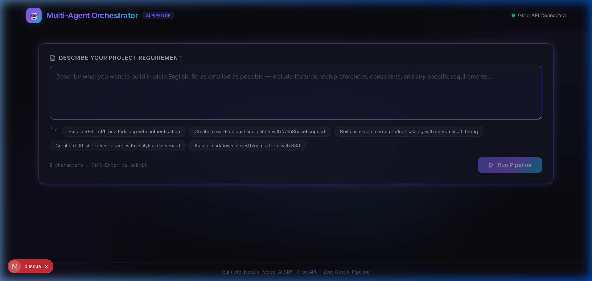
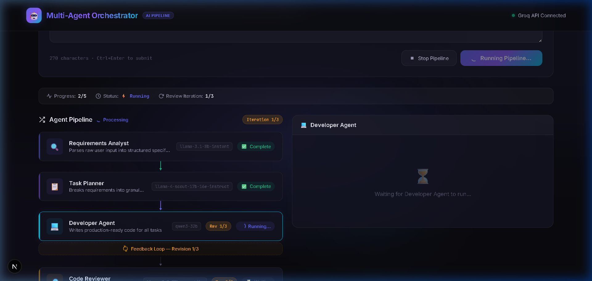
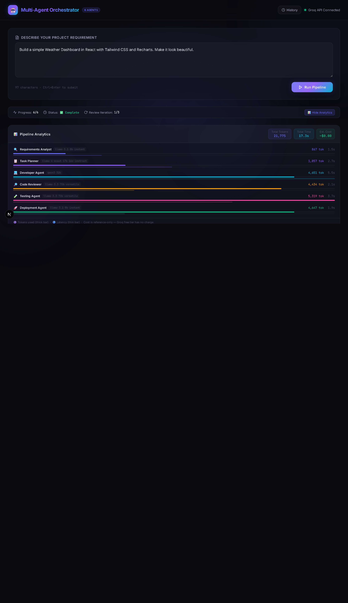
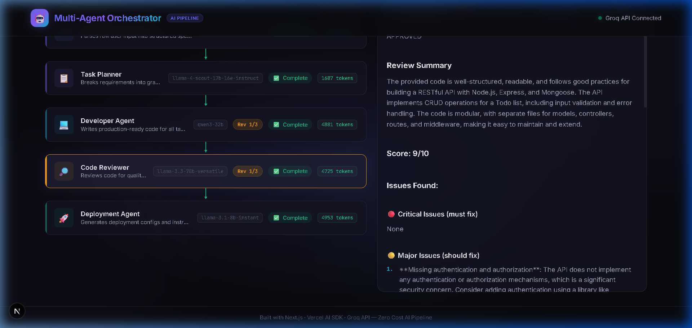
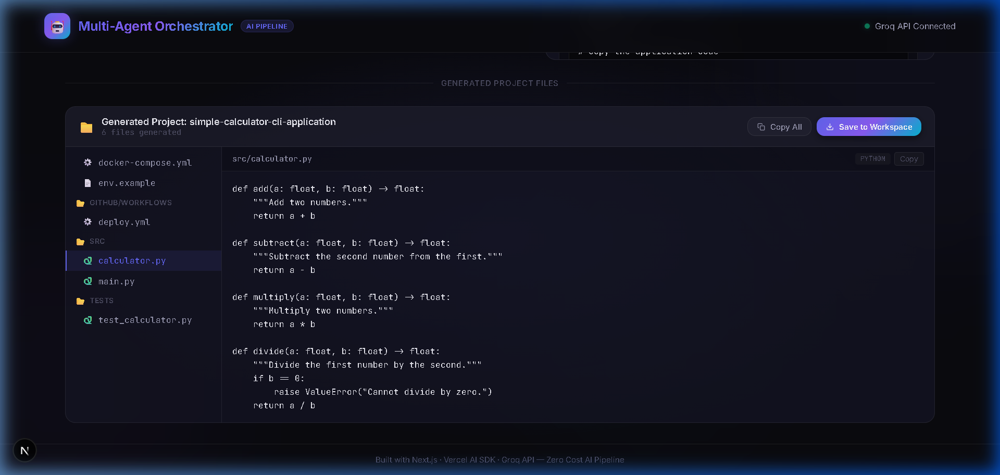
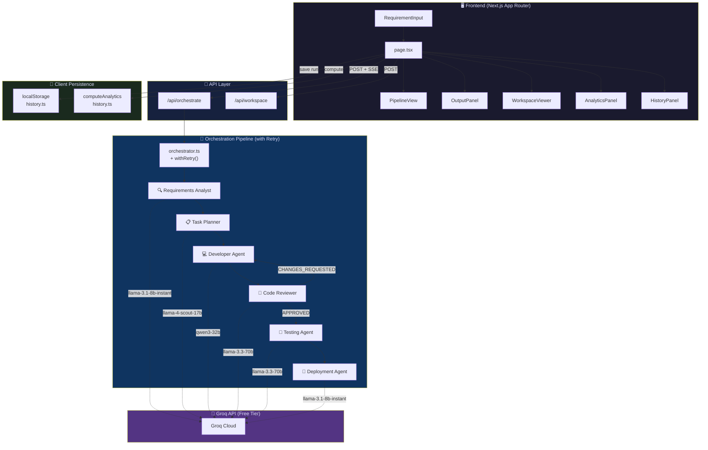

<div align="center">

# 🤖 Multi-Agent Orchestrator

### AI-Powered Software Development Pipeline — Now with 6 Agents

[](https://nextjs.org/)
[](https://www.typescriptlang.org/)
[](https://groq.com/)
[](https://sdk.vercel.ai/)

[](https://github.com/ParthivPandya/multi-agent-orchestrator/stargazers)
[](https://github.com/ParthivPandya/multi-agent-orchestrator/network/members)
[](https://github.com/ParthivPandya/multi-agent-orchestrator/issues)
[](https://github.com/ParthivPandya/multi-agent-orchestrator/commits/main)
[](LICENSE)

**Transform plain English requirements into production-ready, tested, and deployment-configured code** — automatically analyzed, planned, developed, reviewed, tested, and deployed by **6 specialized AI agents** working in concert.

### 🌟 If you find this useful, please give it a star! It helps the project grow! 🌟

[🚀 Quick Start](#-quick-start) · [✨ Features](#-key-features) · [🏗️ Architecture](#️-architecture) · [🤖 Agents](#-the-6-agents) · [📡 API Reference](#-api-reference) · [🗺️ Roadmap](#️-roadmap)

---



</div>

---

## 💡 Why This Project?

<table>
<tr>
<td width="55%">

Most AI code generators are **black boxes** — you type a prompt, wait, and hope for the best. This project takes a fundamentally different approach:

- 🏭 **Software Factory, Not a Chatbot** — 6 agents with distinct roles collaborate like a real dev team
- 🔄 **Self-Correcting** — The Code Reviewer catches bugs and sends code back for revision automatically
- 🧪 **Tests Included** — A dedicated Testing Agent auto-generates unit & integration tests for every project
- 🛡️ **Battle-Hardened** — Every agent call has exponential backoff retry (up to 3 attempts). No more pipeline crashes on rate limits
- 👁️ **Full Transparency** — Watch every agent think in real-time via SSE streaming
- � **Analytics Built-in** — Per-agent token usage, latency charts, and cost estimates after every run
- 🕐 **History & Recall** — Every pipeline run is saved and can be restored with one click
- 💸 **100% Free** — Runs on Groq's free tier. No OpenAI bills. No subscriptions.

</td>
<td width="45%">

### The 6-Agent Pipeline

```
You: "Build a REST API for a
      todo app with auth"
         ↓
🔍 Analyst   → Structured specs
📋 Planner   → Task breakdown
💻 Developer → Production code
      ↕ (Self-correcting loop)
🔎 Reviewer  → Quality check
🧪 Tester    → Unit test suite ← NEW
🚀 Deployer  → Docker + CI/CD
         ↓
You: Complete project + tests,
     ready to ship! 🎉
```

</td>
</tr>
</table>

---

## ✨ Key Features

<table>
<tr>
<td width="50%">

### 🔄 Fully Automated 6-Agent Pipeline
Plain English → production code → unit tests → deployment config. Zero manual intervention.

### � Auto-Generated Test Suite *(New!)*
The Testing Agent writes comprehensive Jest/Pytest/Go tests automatically based on the tech stack detected in the generated code.

### 🛡️ Exponential Backoff Retry *(New!)*
Every agent call is wrapped in retry logic: 3 automatic attempts with 2s → 4s → 8s backoff. Transient Groq API errors are handled silently.

### 🔁 Developer ↔ Reviewer Loop
Built-in feedback cycle: Code Reviewer sends rejected code back to Developer for revision (up to 3 iterations).

</td>
<td width="50%">

### 📊 Analytics Dashboard *(New!)*
Toggle the analytics panel after any run to see per-agent token usage, latency bars, and estimated cost — all in one view.

### 🕐 Pipeline History *(New!)*
Every run is saved to `localStorage`. Open the History panel, browse past runs with timestamps, and restore any of them with one click.

### � ZIP Export *(New!)*
"Download ZIP" button in the workspace viewer bundles all generated files (source + tests + configs) into a `.zip` for instant download.

### ⚡ Real-Time SSE Streaming
Every agent's start, progress, and completion is streamed live to the UI — including retry notifications in real time.

### � Workspace File Manager
Auto-extracts all generated files into an IDE-like tree viewer. Files include source code, test files (🧪), and deployment configs.

</td>
</tr>
</table>

---

## 🏆 How Does It Compare?

| Feature | **This Project** | AutoGPT | MetaGPT | CrewAI |
|---------|:---------------:|:-------:|:-------:|:------:|
| 💸 Completely Free | ✅ Groq free tier | ❌ Requires OpenAI key | ❌ Requires OpenAI key | ❌ Requires API key |
| 🖥️ Beautiful Web UI | ✅ Premium dark theme | ⚠️ Basic | ⚠️ CLI only | ⚠️ CLI only |
| ⚡ Real-time Streaming | ✅ SSE events | ❌ | ❌ | ❌ |
| 🔁 Self-Correcting Code | ✅ Dev↔Review loop | ❌ | ⚠️ Partial | ⚠️ Partial |
| 🧪 Auto Test Generation | ✅ Dedicated agent | ❌ | ❌ | ❌ |
| 🛡️ Retry on Failure | ✅ Exp. backoff | ❌ | ❌ | ⚠️ Partial |
| 📊 Analytics Dashboard | ✅ Built-in | ❌ | ❌ | ❌ |
| 🕐 Run History & Restore | ✅ localStorage | ❌ | ❌ | ❌ |
| � ZIP Export | ✅ One click | ❌ | ❌ | ❌ |
| 📦 Ready-to-Deploy Output | ✅ Docker + CI/CD | ❌ | ❌ | ❌ |
| � One-Click Deploy | ✅ Vercel button | ❌ | ❌ | ❌ |

---

## 📸 Screenshots

<details>
<summary><b>🖥️ Click to expand all screenshots</b></summary>

<br>

### 6-Agent Pipeline In Progress
> Requirements Analyst ✅ → Task Planner ✅ → Developer Agent ⚡ Running...



### Pipeline Complete — All 6 Agents Finished
> Every agent shows completion status with token count and latency.



### Code Review Output — Score: 9/10
> The reviewer provides structured feedback: approval status, score, issues found, and suggestions.



### Analytics Dashboard
> Per-agent token (thick bar) and latency (thin bar) breakdown, with total tokens, time, and estimated cost.


### Pipeline History Panel
> Slide-in panel showing past runs. Click "Restore this run" to reload any previous result instantly.


### Generated Project Files — Source + Tests + Configs
> Auto-extracted files with 🧪 test files highlighted. "Download ZIP" bundles everything for instant download.



</details>

---

## 🏗️ Architecture



---

## 🤖 The 6 Agents

| # | Agent | Model | Purpose | Max Tokens |
|---|-------|-------|---------|------------|
| 1 | 🔍 **Requirements Analyst** | `llama-3.1-8b-instant` | Parses raw English → structured JSON specification with FRs, NFRs, acceptance criteria, tech stack | 2,048 |
| 2 | 📋 **Task Planner** | `llama-4-scout-17b-16e-instruct` | Breaks specifications → ordered tasks with IDs, priorities, dependencies, and sizing | 2,048 |
| 3 | 💻 **Developer Agent** | `qwen/qwen3-32b` | Writes complete, production-ready source code for all planned tasks | 4,096 |
| 4 | 🔎 **Code Reviewer** | `llama-3.3-70b-versatile` | Reviews code quality, security, best practices. Returns APPROVED or CHANGES_REQUESTED with score | 2,048 |
| 5 | 🧪 **Testing Agent** *(New!)* | `llama-3.3-70b-versatile` | Auto-generates unit & integration tests matched to the tech stack. Non-fatal — pipeline continues if it fails | 3,072 |
| 6 | 🚀 **Deployment Agent** | `llama-3.1-8b-instant` | Generates Dockerfile, docker-compose.yml, CI/CD pipelines, and deployment guides | 2,048 |

> **All 6 agents** are individually wrapped in `withRetry()` — up to 3 attempts with exponential backoff (2s → 4s → 8s). Testing Agent failures are non-fatal and the pipeline continues to Deployment automatically.

### Developer ↔ Reviewer Feedback Loop

```
Developer writes code
        ↓
Code Reviewer reviews
        ↓
   APPROVED? ──── Yes ──→ Testing Agent → Deployment Agent
        ↓
       No (CHANGES_REQUESTED)
        ↓
Developer revises (max 3 iterations)
```

---

## 🚀 Quick Start

### Prerequisites

- **Node.js** 18+ ([Download](https://nodejs.org/))
- **Groq API Key** (Free — [Get one here](https://console.groq.com/))

### Installation

```bash
# 1. Clone the repository
git clone https://github.com/ParthivPandya/multi-agent-orchestrator.git
cd multi-agent-orchestrator

# 2. Install dependencies
npm install

# Optional: Install jszip for proper ZIP export (falls back to .txt otherwise)
npm install jszip

# 3. Set up environment variables
cp .env.example .env.local
```

### Configuration

Edit `.env.local` and add your Groq API key:

```env
# Get your free key at https://console.groq.com
GROQ_API_KEY=gsk_your_api_key_here
```

### Run

```bash
# Development server
npm run dev

# Open in browser
# → http://localhost:3000
```

### Build for Production

```bash
npm run build
npm start
```

---

## 📁 Project Structure

```
multi-agent-system/
├── src/
│   ├── app/
│   │   ├── page.tsx                    # Main UI — state, SSE, history save/restore
│   │   ├── layout.tsx                  # Root layout with SEO metadata
│   │   ├── globals.css                 # Premium dark design system + animations
│   │   └── api/
│   │       ├── orchestrate/route.ts    # POST — 6-agent pipeline with SSE streaming
│   │       ├── agent/route.ts          # POST — Test individual agents
│   │       └── workspace/
│   │           ├── route.ts            # GET/POST — List & save workspace files
│   │           └── [project]/file/
│   │               └── route.ts        # GET — Read individual file content
│   ├── lib/
│   │   ├── orchestrator.ts             # 🎯 Pipeline controller + withRetry() + 6 agents
│   │   ├── context.ts                  # Shared state between agents
│   │   ├── fileParser.ts               # Extracts code files from markdown output
│   │   ├── history.ts                  # 🕐 localStorage pipeline history + analytics
│   │   ├── types/index.ts              # TypeScript type definitions (incl. new types)
│   │   ├── agents/
│   │   │   ├── requirementsAnalyst.ts  # Agent 1 — Requirement parsing
│   │   │   ├── taskPlanner.ts          # Agent 2 — Task decomposition
│   │   │   ├── developer.ts            # Agent 3 — Code generation
│   │   │   ├── codeReviewer.ts         # Agent 4 — Code review
│   │   │   ├── testingAgent.ts         # Agent 5 — Unit & integration test generation 🆕
│   │   │   └── deploymentAgent.ts      # Agent 6 — Deployment configs
│   │   └── prompts/
│   │       ├── analyst.prompt.ts       # System prompt for Agent 1
│   │       ├── planner.prompt.ts       # System prompt for Agent 2
│   │       ├── developer.prompt.ts     # System prompt for Agent 3
│   │       ├── reviewer.prompt.ts      # System prompt for Agent 4
│   │       ├── testing.prompt.ts       # System prompt for Agent 5 🆕
│   │       └── deployer.prompt.ts      # System prompt for Agent 6
│   └── components/
│       ├── RequirementInput.tsx        # Input form with example prompts + history restore
│       ├── PipelineView.tsx            # Visual 6-stage pipeline progress
│       ├── AgentCard.tsx               # Individual agent status card
│       ├── OutputPanel.tsx             # Formatted/Raw/JSON output tabs
│       ├── WorkspaceViewer.tsx         # File tree + code viewer + save + ZIP export 🆕
│       ├── AnalyticsPanel.tsx          # Per-agent token/latency bar chart 🆕
│       └── HistoryPanel.tsx            # Slide-in past-runs panel with restore 🆕
├── workspace/                          # 📂 Generated projects are saved here
├── .env.example                        # Environment variable template
├── package.json
└── tsconfig.json
```

---

## 📡 API Reference

### `POST /api/orchestrate`

Runs the full **6-agent** pipeline with real-time SSE streaming.

**Request:**
```json
{
  "requirement": "Build a REST API for a todo app with authentication"
}
```

**Response:** Server-Sent Events stream with the following event types:

| Event Type | Description |
|------------|-------------|
| `stage_start` | Agent has started processing |
| `stage_complete` | Agent finished — includes output, token count, and latency |
| `stage_error` | Agent encountered an unrecoverable error (after all retries) |
| `retry_attempt` | An agent failed and is being retried — includes attempt number and wait time |
| `iteration_info` | Developer↔Reviewer loop iteration update |
| `pipeline_complete` | All agents finished |
| `final_result` | Complete results payload |

---

### `POST /api/agent`

Test an individual agent in isolation.

**Request:**
```json
{
  "agentName": "testing-agent",
  "input": "function add(a, b) { return a + b; }"
}
```

**Valid agent names:** `requirements-analyst`, `task-planner`, `developer`, `code-reviewer`, `testing-agent`, `deployment-agent`

---

### `POST /api/workspace`

Save generated project files (source + tests + configs) to disk.

**Request:**
```json
{
  "projectName": "my-todo-app",
  "files": [
    { "path": "src/index.ts", "content": "..." },
    { "path": "src/index.test.ts", "content": "..." },
    { "path": "Dockerfile", "content": "..." }
  ]
}
```

---

### `GET /api/workspace`

List all saved projects in the workspace.

---

## 🛡️ Rate Limiting & Resilience

| Setting | Value |
|---------|-------|
| Inter-agent delay | 1,500ms (prevents Groq rate limits) |
| Max retry attempts per agent | **3** |
| Retry backoff schedule | 2s → 4s → 8s (exponential) |
| Max review iterations | 3 |
| Testing Agent failure | **Non-fatal** — pipeline continues to deployment |
| Groq free tier RPM | 30 requests/min |
| Groq free tier TPM | ~14,400 tokens/min |
| Max output per agent | 2,048 – 4,096 tokens |

---

## 🛠️ Tech Stack

| Technology | Purpose |
|------------|---------|
| [Next.js 16](https://nextjs.org/) | Full-stack React framework (App Router) |
| [TypeScript](https://www.typescriptlang.org/) | Type-safe development |
| [Vercel AI SDK v6](https://sdk.vercel.ai/) | Unified LLM interface |
| [@ai-sdk/groq](https://www.npmjs.com/package/@ai-sdk/groq) | Groq API provider |
| [Groq Cloud](https://groq.com/) | Ultra-fast LLM inference (free tier) |
| [jszip](https://stuk.github.io/jszip/) *(optional)* | Client-side ZIP file generation |
| Vanilla CSS | Custom glassmorphism design system + animations |

---

## 🚢 Deployment

### Deploy to Vercel (Recommended)

[](https://vercel.com/new/clone?repository-url=https://github.com/ParthivPandya/multi-agent-orchestrator&env=GROQ_API_KEY&envDescription=Get%20your%20free%20Groq%20API%20key&envLink=https://console.groq.com/)

1. Click the button above
2. Add your `GROQ_API_KEY` in the environment variables
3. Deploy — you're done! 🎉

### Deploy with Docker

```bash
# Build the image
docker build -t multi-agent-orchestrator .

# Run the container
docker run -p 3000:3000 -e GROQ_API_KEY=your_key_here multi-agent-orchestrator
```

---

## 🗺️ Roadmap

### ✅ Completed & Shipped

- [x] 5-agent automated pipeline with role-specific LLM models
- [x] Real-time SSE streaming UI with live agent progress
- [x] Developer ↔ Reviewer feedback loop (up to 3 iterations)
- [x] Workspace file manager with file tree viewer & save-to-disk
- [x] Premium glassmorphism dark UI with micro-animations
- [x] Individual agent testing API (`POST /api/agent`)
- [x] **🧪 Agent 6: Testing Agent** — Auto-generates unit & integration tests
- [x] **�️ Error Retry & Resilience** — Exponential backoff (2s → 4s → 8s) for all agents
- [x] **📊 Analytics Dashboard** — Per-agent token usage, latency bars, cost estimate
- [x] **� Pipeline History & Persistence** — localStorage save/restore of past runs
- [x] **📥 ZIP Export** — One-click download of all generated files
- [x] **⏱️ Latency Tracking** — Per-agent `latencyMs` measured and displayed
- [x] **🔔 Retry Notifications** — Live amber banner shown when a retry fires

---

### � Coming Soon

<details>
<summary><b>1. 🌐 Multi-Provider LLM Support</b> — OpenAI, Anthropic, Ollama alongside Groq</summary>

Add a provider abstraction layer using Vercel AI SDK's built-in multi-provider support. Allow per-agent model selection from the UI, and support local models via Ollama for fully offline usage.

**Why it matters:** Makes the project useful to 10× more developers — anyone with any API key can use it.

</details>

<details>
<summary><b>2. ✋ Human-in-the-Loop Review</b> — Pause pipeline for user approval before deployment</summary>

Add a "Pause before Deployment" toggle. When the Code Reviewer approves, show a modal with the generated code. User can type corrections or approve to continue — creating an interactive pair-programming experience.

</details>

<details>
<summary><b>3. 🔗 GitHub Integration</b> — One-click push generated code to a new GitHub repo</summary>

Add GitHub PAT configuration in settings. A "Push to GitHub" button creates a new repo via the GitHub API and auto-commits all generated files with a descriptive message.

</details>

<details>
<summary><b>4. ⚡ Streaming Token-by-Token Output</b> — Watch code appear in real time</summary>

Switch agents from `generateText` to `streamText` (Vercel AI SDK). Stream individual tokens to the OutputPanel so users see code being written character by character.

</details>

<details>
<summary><b>5. ⚙️ Prompt Template Customization UI</b> — Edit agent system prompts from the browser</summary>

Show editable text areas for each agent's system prompt in a settings panel. Save custom prompts to `localStorage` with a "Reset to Default" button per agent.

</details>

---

### � Future Vision

| Feature | Description |
|---------|-------------|
| 🧠 **Agent Memory** | Learn user preferences across sessions (coding style, language, frameworks) |
| 🖼️ **Vision-to-Code** | Upload UI mockups/screenshots → generate matching frontend code |
| 🌍 **Multi-Language Output** | Support Python, Go, Rust, Java — not just TypeScript/JavaScript |
| 🔌 **Plugin System** | Community-contributed agents (security scanner, API docs generator, etc.) |
| 📱 **Mobile-Responsive UI** | Full mobile support for on-the-go code generation |
| 🏗️ **Project Templates** | Pre-built starters (Next.js, Express, FastAPI) to reduce token usage |
| 🤝 **Collaborative Mode** | Multiple users working on the same pipeline in real-time |

---

## 🤝 Contributing

Contributions are welcome! The project is actively growing.

### How to Get Started

1. **Fork** the repository
2. **Create** a feature branch: `git checkout -b feature/amazing-feature`
3. **Commit** your changes: `git commit -m 'Add amazing feature'`
4. **Push** to the branch: `git push origin feature/amazing-feature`
5. **Open** a Pull Request

### Good First Issues

| Task | Difficulty | Description |
|------|:----------:|-------------|
| 🌐 Multi-Provider LLM | Medium | Add `@ai-sdk/openai` as an alternative provider option |
| ✋ Human-in-the-Loop | Medium | Add a pause modal before the Deployment Agent runs |
| � GitHub Push | Medium | Create `lib/github.ts` using the GitHub REST API |
| ⚡ Token Streaming | Hard | Switch agents from `generateText` to `streamText` |
| 📱 Mobile UI | Easy | Make the layout responsive for smaller screens |

> 💡 **Tip for new contributors:** Look at `src/lib/agents/testingAgent.ts` — it's the newest and cleanest example of the agent pattern. Every agent follows this same structure, so adding a new one takes ~30 minutes!

---

## 📄 License

This project is licensed under the MIT License — see the [LICENSE](LICENSE) file for details.

---

<div align="center">

### Built with ❤️ by [Parthiv Pandya](https://github.com/ParthivPandya)

**Next.js** · **Vercel AI SDK** · **Groq API** · **TypeScript**

---

<sub>If this project saved you time or taught you something, consider giving it a ⭐</sub>

**[⬆ Back to Top](#-multi-agent-orchestrator)**

</div>
