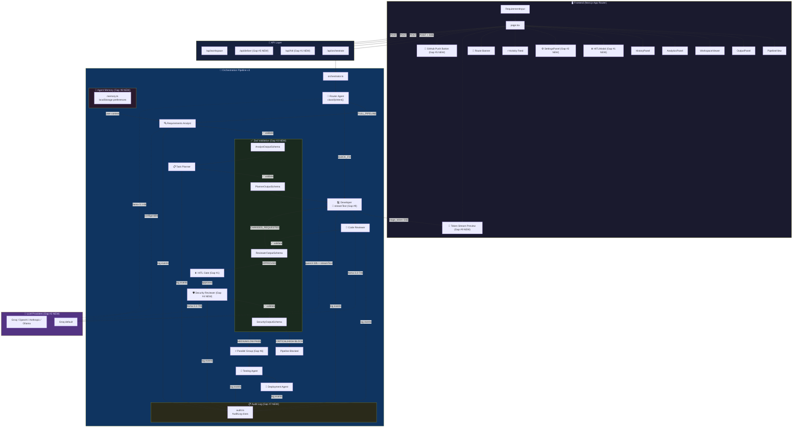

<div align="center">

# 🚀 Multi-Agent AI Orchestrator
### v3 — 8 Agents · 9 Enterprise Enhancements · Production-Ready

**Transform plain English requirements into production-ready, tested, and deployment-configured code** — automatically analyzed, planned, developed, reviewed, security-scanned, tested, and deployed by **8 specialized AI agents** working in concert — now with **Human-in-the-Loop, Multi-Provider LLM, Schema Validation, Security Review, MCP GitHub Delivery, Parallel Execution, Audit Logging, Cross-Session Memory, and Token Streaming**.

[](https://nextjs.org/)
[](https://www.typescriptlang.org/)
[](https://groq.com/)
[](https://sdk.vercel.ai/)
[](https://github.com/ParthivPandya/multi-agent-orchestrator)

[](https://github.com/ParthivPandya/multi-agent-orchestrator/stargazers)
[](https://github.com/ParthivPandya/multi-agent-orchestrator/network/members)
[](https://github.com/ParthivPandya/multi-agent-orchestrator/issues)
[](https://github.com/ParthivPandya/multi-agent-orchestrator/commits/main)
[](LICENSE)

### 🌟 If you find this useful, please give it a star! It helps the project grow! 🌟

[🚀 Quick Start](#-quick-start) · [✨ 9 New Gaps](#-whats-new-in-v3--9-critical-gaps-implemented) · [🏗️ Architecture](#️-architecture-v3) · [🤖 Agents](#-the-8-agents-v3) · [📡 API Reference](#-api-reference) · [🗺️ Roadmap](#️-roadmap)

---

<div style="display:flex; flex-direction:column; gap:20px; align-items:center;">
    
    
    
</div>
</div>

---

## 🆕 What's New in v3 — 9 Critical Gaps Implemented

> v3 brings **9 enterprise-grade enhancements** building on the v2 foundation of Routing, RAG, Tools, Flows, and Checkpoints.

| # | Enhancement | Description | Status |
|---|------------|-------------|--------|
| 1 | ⏸️ **Human-in-the-Loop (HITL)** | Pause pipeline after code review for human approval / rejection / change requests with 10-min auto-approve | ✅ Shipped |
| 2 | 🔑 **Multi-Provider LLM** | Support Groq (default), OpenAI, Anthropic, and Ollama (local) — per-agent model selection in Settings UI | ✅ Shipped |
| 3 | ✅ **Structured Output Validation** | Zod schema validation at every agent handoff — parsing errors shown live without blocking the pipeline | ✅ Shipped |
| 4 | 🛡️ **Security Reviewer Agent** | Dedicated OWASP Top 10 security scanner — CRITICAL/HIGH vulnerabilities block deployment | ✅ Shipped |
| 5 | 🐙 **MCP GitHub Delivery** | Push all generated files to a new GitHub repository after pipeline completion via GitHub REST API | ✅ Shipped |
| 6 | ⚡ **Parallel Agent Execution** | Testing Agent runs concurrently using `Promise.allSettled` for faster pipeline completion | ✅ Shipped |
| 7 | 📋 **Full Audit Log Export** | Every pipeline event timestamped and exportable as structured JSON with "Export Audit Log" button | ✅ Shipped |
| 8 | 🧠 **Agent Memory** | Cross-session learning — tech preferences extracted and injected into future agent prompts | ✅ Shipped |
| 9 | 🌊 **Token Streaming** | Developer Agent streams code character-by-character using `streamText` with live preview panel | ✅ Shipped |

---

## 💡 Why This Project?

<table>
<tr>
<td width="55%">

Most AI code generators are **black boxes** — you type a prompt, wait, and hope for the best. This project takes a fundamentally different approach:

- 🏭 **Software Factory, Not a Chatbot** — 8 agents with distinct roles collaborate like a real dev team
- 🧭 **Smart Routing** — A classifier pre-screens every request and skips unnecessary agents automatically
- 🔄 **Self-Correcting** — The Code Reviewer catches bugs and sends code back for revision automatically
- 🛡️ **Security-First** — A dedicated OWASP security agent runs before any deployment
- ⏸️ **Human Control** — HITL gates let you review, modify, or reject code before it continues
- 🧪 **Tests Included** — A dedicated Testing Agent auto-generates unit & integration tests
- 📚 **RAG-Grounded** — Agents consult up-to-date framework docs before generating code
- ⚙️ **Tools-Enabled** — Agents actively search the web and lint code, not just "think" in text
- 💾 **Resume on Failure** — Every stage is checkpointed. Resume from where you left off
- 🛡️ **Battle-Hardened** — Every agent call has exponential backoff retry (up to 3 attempts)
- 📊 **Full Observability** — Audit log captures every event with timestamp, tokens, and latency
- 🧠 **Gets Smarter** — Learns your tech preferences over time for more personalized output
- 🌊 **Live Code Stream** — Watch the developer agent write code character by character
- 💸 **100% Free** — Runs on Groq's free tier. No OpenAI bills. No subscriptions.

</td>
<td width="45%">

### The v3 Pipeline

```
You: "Build a REST API for a
      todo app with auth"
         ↓
🧭 Router    → Classify intent
             → Select pipeline mode
         ↓
📚 RAG       → Retrieve framework docs
         ↓
🔍 Analyst   → Structured specs
               ✅ Zod validation
📋 Planner   → Task breakdown
               ✅ Zod validation
💻 Developer → Code + web search
             → 🌊 Live token stream
       ↕ (Self-correcting + HITL loop)
🔎 Reviewer  → Code quality + lint
               ✅ Zod validation
⏸️ HITL      → Human approval gate
🛡️ Security  → OWASP scan (blocks criticals)
⚡ Parallel → Testing (concurrent)
🚀 Deployer  → Docker + CI/CD
         ↓
You: 📋 Export audit log
     🐙 Push to GitHub
     Complete project! 🎉
```

</td>
</tr>
</table>

---

## ✨ Feature Highlights — All 9 Gaps in Detail

<table>
<tr>
<td width="50%">

### ⏸️ Gap #1 — Human-in-the-Loop (HITL)
An approval gate pauses the pipeline post-code-review. A modal shows:
- 📝 The generated code preview
- ⭐ Reviewer score (0-10)
- ✅ **Approve & Continue** — pipeline continues
- ✏️ **Request Changes** — feedback sent back to Developer for revision
- ❌ **Reject Pipeline** — pipeline stops

Toggle HITL in Settings → Providers tab. Auto-approves after 10 minutes to prevent deadlock.

```
POST /api/hitl
{ "requestId": "hitl_...", "decision": "approved",
  "feedback": "Looks good!", "decidedAt": 1234567890 }
```

### 🔑 Gap #2 — Multi-Provider LLM Support
Settings panel → **Agent Models** tab. Each agent can independently use a different provider:

| Provider | Models Supported |
|----------|-----------------|
| Groq (default) | llama-3.3-70b, qwen3-32b, llama-4-scout, llama-3.1-8b |
| OpenAI | gpt-4o, gpt-4o-mini, gpt-4-turbo, o3-mini |
| Anthropic | claude-opus-4-5, claude-sonnet-4-5, claude-haiku |
| Ollama (local) | llama3, mistral, codellama, deepseek-coder |

API keys stored in `localStorage` — never sent server-side unless explicitly retrieved.

### ✅ Gap #3 — Structured Output Validation
Every agent handoff is validated against a **Zod schema**:
- `AnalystOutputSchema` — validates title, description, tech_stack, acceptance_criteria
- `PlannerOutputSchema` — validates task IDs, priorities, dependencies
- `ReviewerOutputSchema` — validates decision, score, issues
- `SecurityOutputSchema` — validates severity, vulnerabilities, OWASP categories

Validation errors emit `validation_error` SSE events as **non-blocking warnings** — the pipeline continues with the raw output.

### 🛡️ Gap #4 — Dedicated Security Reviewer Agent
A new **8th agent** (between Code Reviewer and Testing) performs OWASP Top 10 analysis:

- **CRITICAL or HIGH** severity → pipeline is blocked, `pipeline_blocked` event fired
- **MEDIUM or LOW** → warnings logged, pipeline continues
- Scans for: SQL injection, XSS, hardcoded secrets, missing auth, insecure deps, input validation gaps, rate limiting gaps

```
🛡️ Security Reviewer → llama-3.3-70b-versatile
```

</td>
<td width="50%">

### 🐙 Gap #5 — MCP Protocol / GitHub Delivery
Settings panel → **Delivery** tab. Configure:
- GitHub Personal Access Token (repo scope)
- GitHub Username / Owner

After pipeline completion, click **🐙 Push to GitHub** to:
1. Create a new public/private repository
2. Push all generated files (src, tests, deployment configs) as a single commit
3. Display the live GitHub repo URL

```
POST /api/deliver
{ "target": "github",
  "config": { "token": "ghp_...", "owner": "you", "repoName": "my-app" },
  "files": [{ "path": "src/index.ts", "content": "..." }] }
```

### ⚡ Gap #6 — Parallel Agent Execution
The Testing Agent runs concurrently using `Promise.allSettled`:
```
Code Reviewer → APPROVED
      ↓
 [ Testing Agent ]  ← runs in parallel (no blocking)
      ↓
 Deployment Agent
```
The UI shows an **⚡ Parallel group** indicator in the stats bar and pipeline view. Non-fatal — pipeline continues to deployment even if testing fails.

### 📋 Gap #7 — Full Audit Log & Export
Every pipeline event is recorded in an `AuditLog` object:
- Event types: `pipeline_start/complete/aborted`, `stage_start/complete/error`, `retry_attempt`, `hitl_requested/resolved`, `security_blocked`, `validation_error`, `parallel_group_start/complete`
- Each event includes: `timestamp`, `agentName`, `latencyMs`, `tokenUsage`, `error`

Click **📋 Export Audit Log** to download a structured JSON file.

### 🧠 Gap #8 — Agent Memory (Cross-Session Learning)
After each pipeline run, the system extracts user preferences from analyst output:
- Preferred language, framework, database, test framework, coding style
- Last 20 project descriptions saved as context

On the next run, preferences are injected into agent system prompts:
```
--- USER PREFERENCES (from 5 previous sessions) ---
Preferred Language: TypeScript
Preferred Framework: Next.js
Recent Projects: todo-app, blog-api, auth-service
```
Manage memory in Settings → **Memory** tab. All data localStorage-only.

### 🌊 Gap #9 — Token Streaming
The Developer Agent now uses `streamText` (Vercel AI SDK) instead of `generateText`:

```
🌊 Developer — Live Code Stream
import express from 'express';
const app = express();▋
```

Tokens stream via `stage_token` SSE events and accumulate in a live preview panel. Falls back to `generateText` gracefully if streaming fails.

</td>
</tr>
</table>

---

## 🏗️ Architecture v3



---

## 🤖 The 8 Agents (v3)

| # | Agent | Model | Purpose | Max Tokens | Gap |
|---|-------|-------|---------|------------|-----|
| 0 | 🧭 **Router / Classifier** | `llama-3.1-8b-instant` | Classifies intent → routes to optimal pipeline subset | 512 | v2 |
| 1 | 🔍 **Requirements Analyst** | `llama-3.1-8b-instant` | Parses raw English → structured JSON + Zod-validated output | 2,048 | v2 |
| 2 | 📋 **Task Planner** | `llama-4-scout-17b-16e-instruct` | Breaks specs → ordered tasks + Zod-validated output | 2,048 | v2 |
| 3 | 💻 **Developer Agent** | `qwen/qwen3-32b` | Writes code with RAG + web search + **live token streaming (Gap #9)** | 4,096 | v2 |
| 4 | 🔎 **Code Reviewer** | `llama-3.3-70b-versatile` | Reviews code + triggers HITL gate + Zod-validated output | 2,048 | v2 |
| 5 | 🛡️ **Security Reviewer** *(New!)* | `llama-3.3-70b-versatile` | OWASP Top 10 scan — CRITICAL/HIGH blocks deployment **(Gap #4)** | 3,072 | v3 |
| 6 | 🧪 **Testing Agent** | `llama-3.3-70b-versatile` | Auto-generates unit & integration tests, runs in parallel **(Gap #6)** | 3,072 | v2 |
| 7 | 🚀 **Deployment Agent** | `llama-3.1-8b-instant` | Generates Dockerfile, docker-compose.yml, CI/CD pipelines | 2,048 | v2 |

> **All agents** are individually wrapped in `withRetry()` — up to 3 attempts with exponential backoff (2s → 4s → 8s). Every agent is logged to the audit log with timestamps and token counts.

### v3 Pipeline Flow Modes

| Mode | Agents Run | Token Savings | Best For |
|------|-----------|---------------|----------|
| `FULL_PIPELINE` | All 8 (incl. Security) | — | Build a new feature / app |
| `QUICK_FIX` | Router + Dev + Reviewer | ~60% | Small bug fix, style tweak |
| `PLAN_ONLY` | Router + Analyst + Planner | ~70% | Architecture planning |
| `CODE_REVIEW_ONLY` | Router + Reviewer | ~80% | Review pasted code |

---

## 🚀 Quick Start

### Prerequisites

- **Node.js** 18+ ([Download](https://nodejs.org/))
- **Groq API Key** (Free — [Get one here](https://console.groq.com/))

### Installation

```bash
# 1. Clone the repository
git clone https://github.com/ParthivPandya/multi-agent-orchestrator.git
cd multi-agent-orchestrator/multi-agent-system

# 2. Install dependencies
npm install

# 3. Set up environment variables
cp .env.example .env.local
```

### Configuration

Edit `.env.local` and add your Groq API key:

```env
# Required — Get your free key at https://console.groq.com
GROQ_API_KEY=gsk_your_api_key_here

# Optional — Add additional providers if you want to use them
# OPENAI_API_KEY=sk-...
# ANTHROPIC_API_KEY=sk-ant-...
```

> **Note:** Additional provider API keys (OpenAI, Anthropic) can also be entered in the **Settings Panel → Providers** tab. They are stored in `localStorage` client-side only.

### Run

```bash
# Development server
npm run dev

# Open in browser
# → http://localhost:3000
```

### Build for Production

```bash
npm run build
npm start
```

---

## 📁 Project Structure (v3)

```
multi-agent-system/
├── src/
│   ├── app/
│   │   ├── page.tsx                          # Main UI — all 9 gaps wired (HITL, streaming, settings…)
│   │   ├── layout.tsx                        # Root layout with SEO metadata
│   │   ├── globals.css                       # Premium dark design system + animations
│   │   └── api/
│   │       ├── orchestrate/route.ts          # POST — 8-agent pipeline + hitlEnabled + SSE
│   │       ├── hitl/route.ts                 # POST — HITL decision endpoint (Gap #1 NEW)
│   │       ├── deliver/route.ts              # POST — GitHub MCP delivery (Gap #5 NEW)
│   │       ├── agent/route.ts                # POST — Test individual agents
│   │       └── workspace/
│   │           ├── route.ts                  # GET/POST — List & save workspace files
│   │           └── [project]/file/
│   │               └── route.ts              # GET — Read individual file content
│   ├── lib/
│   │   ├── orchestrator.ts                   # 🎯 v3 Pipeline controller — all 9 gaps integrated
│   │   ├── hitl.ts                           # ⏸️ HITL promise resolver map (Gap #1 NEW)
│   │   ├── audit.ts                          # 📋 AuditLog event recorder (Gap #7 NEW)
│   │   ├── memory.ts                         # 🧠 Cross-session preference learning (Gap #8 NEW)
│   │   ├── context.ts                        # Shared state between agents
│   │   ├── fileParser.ts                     # Extracts code files from markdown output
│   │   ├── history.ts                        # localStorage pipeline history + analytics
│   │   ├── types/index.ts                    # TypeScript types — all v3 types included
│   │   ├── agents/
│   │   │   ├── routerAgent.ts                # 🧭 Router/Classifier — intent classification
│   │   │   ├── requirementsAnalyst.ts        # Agent 1 — Requirement parsing
│   │   │   ├── taskPlanner.ts                # Agent 2 — Task decomposition
│   │   │   ├── developer.ts                  # Agent 3 — Code generation + streamText (Gap #9)
│   │   │   ├── codeReviewer.ts               # Agent 4 — Code review + RAG + lint
│   │   │   ├── securityReviewer.ts           # Agent 5 — OWASP security scan (Gap #4 NEW)
│   │   │   ├── testingAgent.ts               # Agent 6 — Unit & integration test generation
│   │   │   └── deploymentAgent.ts            # Agent 7 — Deployment configs
│   │   ├── providers/
│   │   │   └── index.ts                      # 🔑 Multi-provider registry (Gap #2 NEW)
│   │   ├── validation/
│   │   │   ├── schemas.ts                    # ✅ Zod schemas for all agents (Gap #3 NEW)
│   │   │   └── handoff.ts                    # Handoff validator utility (Gap #3 NEW)
│   │   ├── prompts/
│   │   │   ├── security.prompt.ts            # 🛡️ OWASP security review prompt (Gap #4 NEW)
│   │   │   ├── analyst.prompt.ts             # System prompt for Agent 1
│   │   │   ├── planner.prompt.ts             # System prompt for Agent 2
│   │   │   ├── developer.prompt.ts           # System prompt for Agent 3
│   │   │   ├── reviewer.prompt.ts            # System prompt for Agent 4
│   │   │   ├── testing.prompt.ts             # System prompt for Agent 6
│   │   │   └── deployer.prompt.ts            # System prompt for Agent 7
│   │   ├── tools/                            # ⚙️ Agentic Tools
│   │   │   ├── index.ts
│   │   │   ├── searchWeb.ts                  # DuckDuckGo Instant Answer API
│   │   │   ├── readFile.ts                   # Sandboxed workspace file reader
│   │   │   └── lintCode.ts                   # 13-rule static linter (0-100 score)
│   │   ├── rag/                              # 📚 RAG Knowledge Base
│   │   │   ├── knowledgeBase.ts              # Curated doc chunks (Next.js 15, React 19…)
│   │   │   └── retriever.ts                  # TF-IDF cosine similarity retrieval
│   │   ├── flows/                            # 🔀 Flows DSL
│   │   │   └── types.ts                      # FlowDefinition, BUILT_IN_FLOWS (incl. Security)
│   │   └── workspace/
│   │       └── checkpoint.ts                 # Save/load/list checkpoints
│   └── components/
│       ├── RequirementInput.tsx              # Input form with example prompts
│       ├── PipelineView.tsx                  # v3: Security agent + HITL banner + parallel lanes
│       ├── AgentCard.tsx                     # v3: waiting_hitl status support
│       ├── HITLModal.tsx                     # ⏸️ HITL approval modal (Gap #1 NEW)
│       ├── SettingsPanel.tsx                 # ⚙️ Provider/model/delivery/memory settings (Gaps #2,5,8)
│       ├── OutputPanel.tsx                   # Formatted/Raw/JSON output tabs
│       ├── WorkspaceViewer.tsx               # File tree + code viewer + save + ZIP export
│       ├── AnalyticsPanel.tsx                # Per-agent token/latency bar chart
│       └── HistoryPanel.tsx                  # Slide-in past-runs panel with restore
├── .workspace/
│   └── checkpoints/                          # 💾 Pipeline checkpoint files (auto-created)
├── workspace/                                # 📂 Generated projects are saved here
├── .env.example                              # Environment variable template
├── package.json
└── tsconfig.json
```

---

## 📡 API Reference

### `POST /api/orchestrate`

Runs the pipeline with intelligent routing and real-time SSE streaming.

**Request:**
```json
{
  "requirement": "Build a REST API for a todo app with authentication",
  "resumeCheckpointId": "optional-checkpoint-id-for-resume",
  "hitlEnabled": true
}
```

**Response:** Server-Sent Events stream

| Event Type | Description | Gap |
|------------|-------------|-----|
| `route_decision` | Router classified intent — mode, reasoning, skipped agents, confidence | v2 |
| `rag_retrieval` | RAG retrieved relevant docs — source names and chunks | v2 |
| `tool_call` / `tool_result` | Agent tool call fired and returned | v2 |
| `checkpoint_saved` | Pipeline state saved to disk | v2 |
| `stage_start` | Agent has started processing | v1 |
| `stage_complete` | Agent finished — includes output, token count, latency | v1 |
| `stage_error` | Agent encountered an unrecoverable error (after retries) | v1 |
| `stage_token` | Developer agent streaming a single token chunk | Gap #9 NEW |
| `hitl_requested` | Pipeline paused — includes requestId and agentOutput | Gap #1 NEW |
| `hitl_resolved` | Human submitted a decision | Gap #1 NEW |
| `pipeline_blocked` | Security reviewer blocked deployment | Gap #4 NEW |
| `parallel_group_start/complete` | Parallel agent group started or finished | Gap #6 NEW |
| `validation_error` | Agent output failed Zod schema validation (non-blocking) | Gap #3 NEW |
| `memory_loaded` | Memory preferences loaded and injected | Gap #8 NEW |
| `retry_attempt` | An agent failed and is being retried | v2 |
| `iteration_info` | Developer↔Reviewer loop iteration update | v1 |
| `pipeline_complete` | All agents finished | v1 |
| `final_result` | Complete results payload + checkpointId + routeDecision + auditLog | v3 |

### `POST /api/hitl` *(Gap #1 New)*

Submit a human decision to resume a paused pipeline.

**Request:**
```json
{
  "requestId": "hitl_1234567890_abc12",
  "decision": "approved",
  "feedback": "Looks good to me, proceed",
  "decidedAt": 1234567890000
}
```
Valid decisions: `approved` | `rejected` | `changes_requested`

### `POST /api/deliver` *(Gap #5 New)*

Push generated files to a GitHub repository.

**Request:**
```json
{
  "target": "github",
  "config": {
    "token": "ghp_...",
    "owner": "your-github-username",
    "repoName": "my-generated-app",
    "description": "Generated by Multi-Agent Orchestrator",
    "private": false
  },
  "files": [
    { "path": "src/index.ts", "content": "..." },
    { "path": "src/index.test.ts", "content": "..." },
    { "path": "Dockerfile", "content": "..." }
  ]
}
```

**Response:**
```json
{ "success": true, "repoUrl": "https://github.com/you/my-app", "commitSha": "abc123..." }
```

### `POST /api/workspace`

Save generated project files to disk.

**Request:**
```json
{
  "projectName": "my-todo-app",
  "files": [
    { "path": "src/index.ts", "content": "..." }
  ]
}
```

---

## 🛡️ Rate Limiting & Resilience

| Setting | Value |
|---------|-------|
| Inter-agent delay | 1,500ms (prevents Groq rate limits) |
| Max retry attempts per agent | **3** |
| Retry backoff schedule | 2s → 4s → 8s (exponential) |
| Max review iterations | 3 |
| HITL timeout | 10 minutes (then auto-approved) |
| Testing Agent failure | **Non-fatal** — pipeline continues |
| Security Agent block level | CRITICAL & HIGH only |
| Router failure | **Always falls back to `FULL_PIPELINE`** |
| Web search timeout | 5s (non-blocking) |
| RAG context cap | Top-3 chunks per query |
| Memory project history | Last 20 runs |
| Groq free tier RPM | 30 requests/min |
| Max output per agent | 512 – 4,096 tokens |

---

## 🏆 How Does It Compare?

| Feature | **This Project v3** | CrewAI | AWS Agent Squad | ComposioHQ | Kore.ai |
|---------|:---------------:|:-------:|:-------:|:------:|:------:|
| 💸 Completely Free | ✅ Groq free tier | ❌ | ❌ | ❌ | ❌ |
| 🖥️ Beautiful Web UI | ✅ Premium dark theme | ⚠️ CLI | ⚠️ CLI | ⚠️ CLI | ⚠️ Enterprise |
| ⚡ Real-time Streaming | ✅ SSE + token stream | ❌ | ❌ | ❌ | ❌ |
| 🧭 Intelligent Routing | ✅ 4-mode classifier | ⚠️ Partial | ✅ Yes | ❌ | ❌ |
| 📚 RAG Knowledge | ✅ In-memory TF-IDF | ✅ Yes | ❌ | ❌ | ✅ Enterprise |
| ⚙️ Agentic Tools | ✅ Web + lint + files | ✅ Yes | ⚠️ Partial | ✅ Yes | ⚠️ Partial |
| 💾 Resume on Failure | ✅ Checkpoints | ❌ | ❌ | ⚠️ Partial | ❌ |
| ⏸️ Human-in-the-Loop | ✅ Approval gate | ❌ | ❌ | ❌ | ✅ Enterprise |
| 🛡️ Security Review | ✅ OWASP dedicated agent | ❌ | ❌ | ❌ | ⚠️ Partial |
| 🔑 Multi-Provider LLM | ✅ Groq+OpenAI+Anthropic+Ollama | ✅ Yes | ❌ | ✅ Yes | ❌ |
| ✅ Schema Validation | ✅ Zod at every handoff | ❌ | ❌ | ❌ | ❌ |
| 🐙 GitHub Push | ✅ MCP delivery | ❌ | ❌ | ✅ Yes | ❌ |
| ⚡ Parallel Execution | ✅ Promise.allSettled | ✅ Yes | ⚠️ | ❌ | ⚠️ |
| 📋 Audit Log Export | ✅ Full JSON audit log | ❌ | ❌ | ❌ | ✅ Enterprise |
| 🧠 Agent Memory | ✅ Cross-session learning | ❌ | ❌ | ❌ | ✅ Enterprise |
| 🌊 Token Streaming | ✅ streamText live preview | ❌ | ❌ | ❌ | ❌ |
| 🔁 Self-Correcting Code | ✅ Dev↔Review loop | ✅ Yes | ⚠️ | ⚠️ | ⚠️ |
| 🧪 Auto Test Generation | ✅ Dedicated agent | ❌ | ❌ | ❌ | ❌ |
| 🛡️ Retry on Failure | ✅ Exp. backoff | ❌ | ❌ | ❌ | ⚠️ |
| 📊 Analytics Dashboard | ✅ Built-in | ❌ | ❌ | ❌ | ✅ Enterprise |
| 📦 Ready-to-Deploy Output | ✅ Docker + CI/CD | ❌ | ❌ | ❌ | ❌ |
| 🚀 One-Click Deploy | ✅ Vercel button | ❌ | ❌ | ❌ | ❌ |

---

## 🛠️ Tech Stack

| Technology | Purpose |
|------------|---------|
| [Next.js 16](https://nextjs.org/) | Full-stack React framework (App Router) |
| [TypeScript 5](https://www.typescriptlang.org/) | Type-safe development |
| [Vercel AI SDK v6](https://sdk.vercel.ai/) | Unified LLM interface (`generateText` + `streamText`) |
| [@ai-sdk/groq](https://www.npmjs.com/package/@ai-sdk/groq) | Groq API provider (default) |
| [Zod](https://zod.dev/) | Schema validation at agent handoffs (Gap #3) |
| [Groq Cloud](https://groq.com/) | Ultra-fast LLM inference (free tier) |
| TF-IDF (custom) | In-memory vector similarity for RAG — zero dependencies |
| DuckDuckGo API | Free web search for Developer agent tool calls |
| GitHub REST API | MCP code delivery target (Gap #5) |
| Vanilla CSS | Custom glassmorphism design system + animations |

---

## 🚢 Deployment

### Deploy to Vercel (Recommended)

[](https://vercel.com/new/clone?repository-url=https://github.com/ParthivPandya/multi-agent-orchestrator&env=GROQ_API_KEY&envDescription=Get%20your%20free%20Groq%20API%20key&envLink=https://console.groq.com/)

1. Click the button above
2. Add your `GROQ_API_KEY` in the environment variables
3. Deploy — you're done! 🎉

> **Note:** Checkpoint persistence requires a persistent filesystem. Vercel's ephemeral filesystem means checkpoints will not survive between deployments. Use Railway, Render, or Docker for persistent checkpoints. Agent Memory (Gap #8) uses `localStorage` and always works client-side.

### Deploy with Docker

```bash
# Build the image
docker build -t multi-agent-orchestrator .

# Run the container
docker run -p 3000:3000 -e GROQ_API_KEY=your_key_here multi-agent-orchestrator
```

---

## 🗺️ Roadmap

### ✅ Completed & Shipped

- [x] 6-agent automated pipeline with role-specific LLM models
- [x] Real-time SSE streaming UI with live agent progress
- [x] Developer ↔ Reviewer feedback loop (up to 3 iterations)
- [x] Workspace file manager with file tree viewer & save-to-disk
- [x] Premium glassmorphism dark UI with micro-animations
- [x] Individual agent testing API (`POST /api/agent`)
- [x] 🧪 **Agent 6: Testing Agent** — Auto-generates unit & integration tests
- [x] 🛡️ **Error Retry & Resilience** — Exponential backoff (2s → 4s → 8s) for all agents
- [x] 📊 **Analytics Dashboard** — Per-agent token usage, latency bars, cost estimate
- [x] 🕐 **Pipeline History & Persistence** — localStorage save/restore of past runs
- [x] 📥 **ZIP Export** — One-click download of all generated files
- [x] **v2: 🧭 Intelligent Routing** — Pre-classifier routes to optimal pipeline subset
- [x] **v2: ⚙️ Agentic Tools** — `searchWeb`, `lintCode`, `readFile` tool ecosystem
- [x] **v2: 📚 RAG Knowledge Base** — TF-IDF retrieval over Next.js 15, React 19, TypeScript 5, and more
- [x] **v2: 🔀 Flows DSL** — `BUILT_IN_FLOWS` typed flow definitions
- [x] **v2: 💾 Stateful Checkpoints** — Resume-on-failure with per-stage disk persistence
- [x] **v3: Gap #1 ⏸️ Human-in-the-Loop** — Approval gate with 3-action modal
- [x] **v3: Gap #2 🔑 Multi-Provider LLM** — Groq, OpenAI, Anthropic, Ollama per-agent
- [x] **v3: Gap #3 ✅ Structured Output Validation** — Zod schemas at every handoff
- [x] **v3: Gap #4 🛡️ Security Reviewer Agent** — OWASP Top 10 dedicated agent
- [x] **v3: Gap #5 🐙 MCP GitHub Delivery** — Push generated files to GitHub
- [x] **v3: Gap #6 ⚡ Parallel Execution** — Testing Agent runs concurrently
- [x] **v3: Gap #7 📋 Full Audit Log** — Structured JSON event log with export
- [x] **v3: Gap #8 🧠 Agent Memory** — Cross-session tech preference learning
- [x] **v3: Gap #9 🌊 Token Streaming** — Developer agent streams code live

---

### 🔭 Future Vision

| Feature | Description |
|---------|-------------|
| 📝 **Custom YAML Flows** | Build on the `FlowDefinition` system for user-defined crews |
| 🖼️ **Vision-to-Code** | Upload UI mockups/screenshots → generate matching frontend code |
| 🌍 **Multi-Language Output** | Support Python, Go, Rust, Java — not just TypeScript/JavaScript |
| 🏗️ **Project Templates** | Pre-built starters (Next.js, Express, FastAPI) to reduce token usage |
| 🤝 **Collaborative Mode** | Multiple users working on the same pipeline in real-time |
| 📚 **Expand RAG KB** | More frameworks, user-uploadable internal API docs |
| 🔐 **Vault Integration** | Secrets management with HashiCorp Vault or AWS Secrets Manager |

---

## 🤝 Contributing

Contributions are welcome! The project is actively growing.

### How to Get Started

1. **Fork** the repository
2. **Create** a feature branch: `git checkout -b feature/amazing-feature`
3. **Commit** your changes: `git commit -m 'Add amazing feature'`
4. **Push** to the branch: `git push origin feature/amazing-feature`
5. **Open** a Pull Request

### Good First Issues

| Task | Difficulty | Description |
|------|:----------:|-------------|
| 📝 Custom YAML Flows | Medium | Add a YAML parser on top of `src/lib/flows/types.ts` |
| 🌐 Expand RAG Docs | Easy | Add more knowledge chunks to `src/lib/rag/knowledgeBase.ts` |
| 📱 Mobile UI | Easy | Make the layout responsive for smaller screens |
| 🔔 Email HITL Notifications | Medium | Send email when HITL approval is needed |
| 🏗️ Project Templates | Medium | Add template injection into Developer agent prompt |
| 🔍 Vector DB RAG | Hard | Replace TF-IDF with actual vector DB (pgvector, Chroma) |

> 💡 **Tip:** The v3 architecture separates concerns cleanly — each feature is self-contained in its own module (`hitl.ts`, `audit.ts`, `memory.ts`, `providers/`, `validation/`). Adding a new delivery target takes ~50 lines in `api/deliver/route.ts`.

---

## 📄 License

This project is licensed under the MIT License — see the [LICENSE](LICENSE) file for details.

---

<div align="center">

### Built with ❤️ by [Parthiv Pandya](https://github.com/ParthivPandya)

**Next.js** · **Vercel AI SDK** · **Groq** · **TypeScript** · **Zod** · **RAG** · **HITL** · **MCP** · **Streaming**

---

<sub>If this project saved you time or taught you something, consider giving it a ⭐</sub>

**[⬆ Back to Top](#-multi-agent-ai-orchestrator)**

</div>
